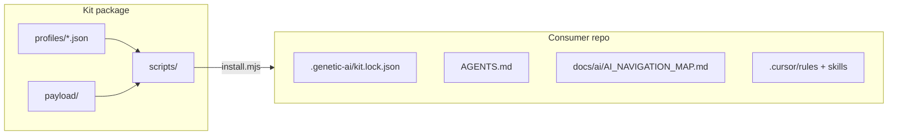

# Architecture — Genetic AI Starter Kit

## Purpose

Portable **Navigation OS** for AI-assisted development — see [meta/docs/NAVIGATION_OS.md](meta/docs/NAVIGATION_OS.md):

L0 genetic tags → L1 `AI_NAVIGATION_MAP` → L2 `AI_INDEX` → L3 genes → L4 Cursor rules/skills → L5 doctor/lock → evidence plane (benchmarks).

The kit does **not** include platform runtime, databases, or hosted AgentStack.

## Components

| Path | Role |
|------|------|
| `profiles/` | File globs per install profile (minimal, standard, full, founder) |
| `payload/` | Templates copied into consumer tree |
| `scripts/install.mjs` | Copy, merge `.cursorrules`, write lock file |
| `scripts/init.mjs` | Interactive wizard → install |
| `scripts/doctor.mjs` | Health check + optional `--beacon` |
| `scripts/validate-kit.mjs` | Maintainer integrity before release |
| `benchmarks/` | Synthetic fixture + rubric for methodology comparison |

## Version resolution

Order: `AGENTSTACK_CORE_VERSION` env → `shared/constants.py` (monorepo) → `PLATFORM_VERSION` file → `KIT_MANIFEST.json`.

## Repository model

- **SoT:** `genetic-ai-starter/` in AgentStack monorepo
- **Public mirror:** [agentstacktech/genetic-ai-starter](https://github.com/agentstacktech/genetic-ai-starter) (`main`, synced by release Action)
- **Platform monorepo:** [agentstacktech/AgentStack](https://github.com/agentstacktech/AgentStack) (`master`) — see [REPOSITORY_LINKS.md](meta/docs/REPOSITORY_LINKS.md)
- **Distribution:** npm `@agentstack/genetic-ai-starter`, GitHub template repo

## Extension boundary

`extensions/agentstack/` adds MCP/8DNA routing excerpts and extra rules when `--with-agentstack` or full/founder profiles are selected. Consumers without AgentStack use standard/minimal profiles only.

## Further reading

- [meta/docs/DOC_HUB.md](meta/docs/DOC_HUB.md)
- [meta/docs/NAVIGATION_OS.md](meta/docs/NAVIGATION_OS.md)
- [meta/docs/INSTALL.md](meta/docs/INSTALL.md)
- [meta/docs/PROFILE_COMPARISON.md](meta/docs/PROFILE_COMPARISON.md)
- [payload/docs/ai/AI_INDEXING_SYSTEM.md](payload/docs/ai/AI_INDEXING_SYSTEM.md) (installed copy)
