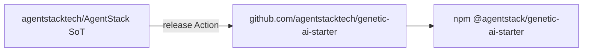

# Genetic AI Starter Kit

[](LICENSE)
[](PLATFORM_VERSION)

**Map-first agent operations** for any repository: philosophy genes → navigation map → Cursor rules → optional [AgentStack](https://agentstack.tech/?utm_source=genetic-ai-starter) extension.

> **Benchmark disclaimer:** Aggregate scores in [`benchmarks/results/`](benchmarks/results/) are **policy-simulated** until the [G38](meta/docs/GAP_REGISTER.md) manual Cursor matrix completes. Do not cite them as vendor benchmarks yet.

## Repository model



Developed in [agentstacktech/AgentStack](https://github.com/agentstacktech/AgentStack) (`genetic-ai-starter/` on `master`); **releases** on [agentstacktech/genetic-ai-starter](https://github.com/agentstacktech/genetic-ai-starter) (`main`) and npm. URL map: [meta/docs/REPOSITORY_LINKS.md](meta/docs/REPOSITORY_LINKS.md).

## Quick start (30s)

**npm (recommended):**

```bash
npx @agentstack/genetic-ai-starter init --yes --target ./my-app --profile standard --project-name "My App" --domain app
```

**Windows:** double-click [`SETUP.cmd`](SETUP.cmd) in the kit folder.

**From clone:**

```bash
node scripts/init.mjs
```

Manual flags: [meta/docs/INSTALL.md](meta/docs/INSTALL.md) · Windows: [meta/docs/INSTALL_WINDOWS.md](meta/docs/INSTALL_WINDOWS.md)

[](https://github.com/agentstacktech/genetic-ai-starter-template/generate)

## Profiles

| Profile | Use | AgentStack |
|---------|-----|------------|
| minimal | Tiny repos | optional |
| **standard** | Default | optional |
| full | Platform consumer + CI sample | included |
| founder | Direct-ship priority | included |

[PROFILE_COMPARISON.md](meta/docs/PROFILE_COMPARISON.md)

## Privacy mode

`--gitignore-kit full` keeps philosophy, map, and Cursor kit files local — see [FAQ.md](FAQ.md).

## Docs

| Doc | Topic |
|-----|--------|
| [ARCHITECTURE.md](ARCHITECTURE.md) | Components and install flow |
| [FAQ.md](FAQ.md) | Common questions |
| [COMMUNITY.md](COMMUNITY.md) | OSS bundle, contributing |
| [CONTRIBUTING.md](CONTRIBUTING.md) | PRs, DCO, issues on **this repo** |
| [SECURITY.md](SECURITY.md) | Vulnerability reporting |

## AgentStack platform (optional)

SDK, MCP, hosted services: https://agentstack.tech/?utm_source=genetic-ai-starter

## Russian README

[README.md](README.md) · [COMMUNITY_ru.md](COMMUNITY_ru.md)

## License

Apache-2.0 — see [LICENSE](LICENSE) and [NOTICE](NOTICE).
