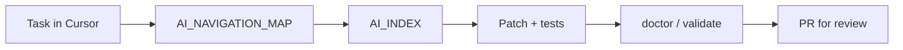

# Genetic AI Starter Kit

**Platform version:** `0.4.11` — aligned with `AGENTSTACK_CORE_VERSION` (monorepo) or [`PLATFORM_VERSION`](PLATFORM_VERSION) (standalone copy).

**Languages:** **English** (this file) · [Русский](README.md)

**Turn any repository into an agent-friendly project in minutes** — with a navigation map, shared vocabulary (genetic tags), Cursor rules, and optional hooks into the [AgentStack](https://agentstack.tech/?utm_source=genetic-ai-starter) platform.

You get **merge-ready agent workflows**: map and genes in git so agents find canonical files, update navigation in the same PR, pass doctor/validate — without you micromanaging paths. Token savings follow from map-first navigation.

**Navigation OS:** [meta/docs/NAVIGATION_OS.md](meta/docs/NAVIGATION_OS.md) · **Doc hub:** [meta/docs/DOC_HUB.md](meta/docs/DOC_HUB.md)

---

## Ship features to release with AI (primary value)

Kit encodes **release discipline in the repo**: map → index → patch → doctor — not “lower token KPI” alone.

| Step | Artifact |
|------|----------|
| Find canonical code | `AI_NAVIGATION_MAP` + `AI_INDEX` |
| Safe edits | `controlled_changes` gene (no bulk sed) |
| New module | Tier 1 row + index in same PR |
| Pre-merge | `doctor` / `validate-kit` |

**Your role:** approve PR, product, security, prod deploy — not “find the file in the monorepo.”

→ [AI_RELEASE_AUTONOMY.md](meta/docs/AI_RELEASE_AUTONOMY.md) · [GENE_ADAPTATION.md](meta/docs/GENE_ADAPTATION.md)

## Weak agent, stable outcomes (raising the floor)

The kit does **not** replace a top model for product design or security. It **levels engineering outcomes** on typical repo tasks: find the canonical file, refuse repo-wide `sed`, update the map, run doctor.

| Situation | Median task score (14 tasks) | Success (≥6) |
|-----------|------------------------------|--------------|
| Weak agent style without map (`agents_md_weak` in harness) | **2.5** | **0%** |
| **Kit + indexes** (same discipline + Navigation OS) | **9** | **100%** |

A strong expensive model without a map may still brute-force a task — with **variance** and context cost. A **cheap model + map, genes, and doctor** hits the **T04 / T05 / T08 / T13** corridor consistently in the harness (e.g. T05 **4→10**, T13 **4→10** vs weak).

→ [AGENT_FLOOR.md](meta/docs/AGENT_FLOOR.md) · [DOC_CLAIMS_AUDIT.md](meta/docs/DOC_CLAIMS_AUDIT.md)

## Production outcomes

| Production risk | Without kit | With kit |
|-----------------|-------------|----------|
| Wrong-module PR | grep roulette | map → index → hot file |
| Release without docs | forgot route/map | T13 + doctor in CI |
| Cheap models on the team | high variance | [AGENT_FLOOR.md](meta/docs/AGENT_FLOOR.md) |
| Onboarding 2+ devs | tribal paths | Tier 1 + genetic tags |
| AgentStack consumers | MCP drift | extension + sync-from-canonical |

Details: [PRODUCTION_OUTCOMES.md](meta/docs/PRODUCTION_OUTCOMES.md).

## AgentStack ecosystem (reference)

Figures from [`platform-stats.snapshot.json`](meta/docs/platform-stats.snapshot.json) (regenerate: `node scripts/export-platform-stats.mjs`):

- **~222** active genes in monorepo philosophy
- **~98** `AI_INDEX.md` on platform packages (excluding CardGame)
- **~267** Tier-1 genetic tags in the central map
- Kit ships **~15** starter genes + **5** Cursor rules + **5** skills (standard)
- Same Navigation OS as [AgentStack](https://github.com/agentstacktech/AgentStack)

Harness metrics (shop-api) are separate: [`metrics.snapshot.json`](meta/docs/metrics.snapshot.json).

### AgentStack vs kit (from snapshot)

| Layer | AgentStack monorepo | Kit install |
|-------|---------------------|-------------|
| Genes | ~222 `.gen1.md` | ~15 starter genes |
| `AI_INDEX` | ~98 platform packages | you fill per subsystem |
| Navigation map | ~267 Tier-1 tags | template + your Tier 1 |
| Harness | internal shop-api | same methodology |

### Gene clusters (starter)

- **Navigation:** `foundation.genetic_coding`, `repo.navigation.map`, `repo.navigation.index`
- **Engineering:** `repo.engineering.controlled_changes`, `repo.engineering.adr`, `repo.engineering.testing`
- **Kit tooling:** `repo.tooling.genetic_starter.*`
- **Founder:** `repo.engineering.founder_direct_ship`

See [GENE_COMPRESSION_MAP.md](payload/philosophy/genes/GENE_COMPRESSION_MAP.md) in your project after install.

## Large codebases (killer feature)

At scale the failure mode is not “too many tokens” but **lost addressability**: agents spawn second auth/webhook/checkout paths, reinforce legacy files, and skip navigation updates — the repo becomes unmaintainable.

| Large-repo problem | What Navigation OS gives you |
|--------------------|------------------------------|
| Context cannot hold the whole tree | **Tier 0** — which package to open first |
| Duplicate subsystems | **Tier 1 + genetic tag** — one canonical contour per meaning |
| Every feature built “from scratch” | **AI_INDEX** — hot files, reuse |
| Legacy traps (`oldCheckout`, stale ARCHITECTURE) | **Traps** section in map + index |
| Drift between releases | **T13:** map + index + doctor in the workflow |

→ [KILLER_FEATURE_LARGE_PROJECTS.md](meta/docs/KILLER_FEATURE_LARGE_PROJECTS.md) · [LARGE_PROJECT_PLAYBOOK.md](meta/docs/LARGE_PROJECT_PLAYBOOK.md)

---

## What problem it solves

| Without the kit | With the kit |
|-----------------|--------------|
| Agents `grep` the whole tree and miss the right module | **Map-first:** `AI_NAVIGATION_MAP.md` points to the right subtree |
| Every repo invents its own `AGENTS.md` / rules from scratch | **Reusable philosophy + genes** — controlled changes, ADRs, testing discipline |
| Cursor rules drift or duplicate on upgrade | **Idempotent install** — one merged `.cursorrules` block, repair/upgrade scripts |
| No way to compare “rules only” vs “map + rules” | **Benchmark harness** — comparable arms (`bare`, `agents_md`, `kit_standard`, …) |
| Platform docs mixed into app repos | **Optional AgentStack extension** — MCP/8DNA routing excerpt, not required for local Cursor work |

---

## What you get (after `init` / `install`)

Concrete artifacts in **your** project (profile-dependent):

| Layer | Files / tools | Benefit |
|-------|----------------|--------|
| **Entry contract** | `AGENTS.md` | One place: order of reading, profile, kit version |
| **Navigation** | `docs/ai/AI_NAVIGATION_MAP.md`, templates, `AI_INDEXING_SYSTEM.md` | Semantic addresses (`app.api.handlers.gen1`) → paths |
| **Philosophy** | `philosophy/genes/`, `GENE_INDEX`, compression map | Compress “how we work” into genes agents can cite |
| **Cursor** | `.cursor/rules/*.mdc`, `.cursor/skills/`, merged `.cursorrules` | Map-first, controlled edits, index authoring — out of the box |
| **Operations** | `docs/ai/OPERATIONS.md`, `doctor`, `repair`, `upgrade` | Health checks and fix partial installs |
| **Scaffolding** | `new-gene.mjs` | New genetic tags without inventing file shape |
| **Privacy** | `--gitignore-kit full` | Keep AI context local — not committed to git |
| **Platform bridge** | `extensions/agentstack` (full/founder) | MCP → 8DNA → command bus routing for AgentStack consumers |
| **CI sample** | `.github/workflows/genetic-ai-validate.yml.sample` | Validate install in consumer pipelines |

Lock file `.genetic-ai/kit.lock.json` records profile, version, and extensions — reproducible upgrades.

---

## Measured impact (benchmark harness)

Reproducible **`shop-api`** fixture, **14** tasks (discovery, maintenance, release gate), scorer **1.2.1**, **synthetic policy** transcripts — not average Cursor chat logs. Run: [BENEFITS_AND_METRICS.md](meta/docs/BENEFITS_AND_METRICS.md) · [METRICS_GLOSSARY.md](meta/docs/METRICS_GLOSSARY.md).

### Task score (0–10)

Per task the scorer sums rubric dimensions (max **10**): correct files, navigation path (map/index/gene), scope discipline, outcome, efficiency. **Success** = score **≥ 6**. **Median task score** = middle value across 14 tasks — also read **success rate** and tasks **T04 / T05 / T13**.

### Summary by arm

| Arm | Median task score | Success (≥6) | Map-first (genetic) |
|-----|-------------------|--------------|---------------------|
| bare | 5.5 | 50% | 0% |
| agents_md_weak * | 2.5 | 0% | 0% |
| agents_md (optimistic) * | 8 | 86% | **7%** |
| **kit standard** | **8** | **93%** | **50%** |
| **kit + indexes** | **9** | **100%** | **86%** |

\* **`agents_md`** is not “your single AGENTS.md in production.” Benchmark arm: [agents.md.only](benchmarks/baselines/agents.md.only) + **optimistic** synthetic transcript (“found the file”, no map maintenance). **`agents_md_weak`** = same file + grep/sed transcript (median **2.5**). Real sessions usually sit **between** them; median **8** for `agents_md` is **optimistic** — genetic map-first is only **7%** (fails **T08** and **T13** at **5**). Install profile **`minimal`** ≠ `agents_md` arm (minimal has rules + stub map). [PROFILE_COMPARISON.md](meta/docs/PROFILE_COMPARISON.md).

### Tasks that matter more than median

| Task | Product meaning | bare | kit + indexes |
|------|-----------------|------|---------------|
| **T04** | Refuse `sed` across all `src/` | 2 | **8** |
| **T05** | New module → map + index | 4 | **10** |
| **T07** | Checkout, not legacy decoy | 1 | **7** |
| **T08** | Catalog bug, right file | 7 | **10** |
| **T13** | Pre-release: map, index, doctor | low | **10** |

### Tokens (secondary)

Step context model on shop-api: bare **~2.3k** / task (median), kit + indexes **~1.1k**; discovery **~3.0k → ~1.1k** (~2.5–3×). Not Cursor API billing. [TOKEN_ECONOMICS.md](meta/docs/TOKEN_ECONOMICS.md) · [TOKEN_REPORT.md](benchmarks/results/TOKEN_REPORT.md).

### Example scenarios (T01–T14)

Per-task prompts, scores, and a sample team week: **[BENEFITS_AND_METRICS.md](meta/docs/BENEFITS_AND_METRICS.md)** (not duplicated here).

Track your own ROI: [ROI_PLAYBOOK.md](meta/docs/ROI_PLAYBOOK.md) · [ROI_PLAYBOOK_ru.md](meta/docs/ROI_PLAYBOOK_ru.md).

---

## Outcomes you can expect

- **Faster onboarding** — map → index → 1–2 files (documented in `AGENTS.md`).
- **Fewer wrong-module edits** — genetic tags + decoy resistance (T07).
- **Cheaper sessions** — **0** unscoped grep vs **18** on bare (14-task matrix, synthetic).
- **Safer edits** — engineering genes block throwaway bulk patches (T04).
- **Navigation stays current** — maintenance genes when subsystems grow (T05).
- **Reproducible upgrades** — `kit.lock.json` + `upgrade.mjs` + `doctor.mjs`.

---

## Who it is for

- **New products** — greenfield repo, standard or full profile.
- **Existing codebases** — install into `--target`; use `repair` if philosophy was partial.
- **Small repos** — `minimal` profile: AGENTS + stub map + 2 rules.
- **AgentStack integrators** — `full` / `founder` + extension overlay.
- **Teams that want local-only AI context** — `gitignore-kit full`.

**Not for:** single-file scripts, throwaway spikes with no structure — use minimal or skip.

---

## Quick start

| Path | Command |
|------|---------|
| **Submodule (recommended)** | `git submodule add https://github.com/agentstacktech/genetic-ai-starter.git tools/genetic-ai-starter` → `node tools/genetic-ai-starter/scripts/bootstrap-standard.mjs --target . --project-name "My App" --domain app` |
| npm / zero-kit | `npx @agentstack/genetic-ai-starter init --yes --target ./my-app --profile standard --project-name "My App" --domain app` |
| Windows | Double-click [`SETUP.cmd`](SETUP.cmd) |

Full guide: [INSTALL.md](meta/docs/INSTALL.md) · [QUICK_SETUP.md](meta/docs/QUICK_SETUP.md) · [INSTALL_WINDOWS.md](meta/docs/INSTALL_WINDOWS.md) · profiles: [PROFILE_COMPARISON.md](meta/docs/PROFILE_COMPARISON.md).

**After install:** fill `docs/ai/AI_NAVIGATION_MAP.md`, add `AI_INDEX.md` for large subsystems, `node <kit>/scripts/doctor.mjs --target .`.

---

## Profiles

| Profile | Best for | AgentStack |
|---------|----------|------------|
| minimal | Tiny repos, experiments | optional |
| **standard** | Most new projects (**default**) | optional |
| full | Platform consumer + CI sample | included |
| founder | Same as full; direct-ship gene emphasis | included |

[PROFILE_COMPARISON.md](meta/docs/PROFILE_COMPARISON.md) · [ROI_PLAYBOOK.md](meta/docs/ROI_PLAYBOOK.md)

---

## Privacy mode

`--gitignore-kit full` keeps philosophy, map, and Cursor kit files on disk for agents but out of git — see [FAQ.md](FAQ.md).

---

## Repositories

| Repo | Branch |
|------|--------|
| [agentstacktech/genetic-ai-starter](https://github.com/agentstacktech/genetic-ai-starter) (this kit) | `main` |
| [agentstacktech/AgentStack](https://github.com/agentstacktech/AgentStack) (platform SoT) | `master` |

Developed in AgentStack monorepo `genetic-ai-starter/`; releases here and on npm. [REPOSITORY_LINKS.md](meta/docs/REPOSITORY_LINKS.md)

---

## Docs

| Doc | Topic |
|-----|--------|
| [DOC_HUB.md](meta/docs/DOC_HUB.md) | **All kit documentation** |
| [PRODUCTION_OUTCOMES.md](meta/docs/PRODUCTION_OUTCOMES.md) | **Production value** |
| [DOC_CLAIMS_AUDIT.md](meta/docs/DOC_CLAIMS_AUDIT.md) | Claims vs evidence |
| [BENEFITS_AND_METRICS.md](meta/docs/BENEFITS_AND_METRICS.md) | **Metrics, tasks T01–T14, scenarios** |
| [AGENT_FLOOR.md](meta/docs/AGENT_FLOOR.md) | **Weak agent → stable engineering outcomes** |
| [AI_RELEASE_AUTONOMY.md](meta/docs/AI_RELEASE_AUTONOMY.md) | **Ship to PR without micromanaging paths** |
| [METRICS_GLOSSARY.md](meta/docs/METRICS_GLOSSARY.md) | Arms, rubric, limitations |
| [COMPARISON_METHODS.md](meta/docs/COMPARISON_METHODS.md) | vs grep / RAG / AGENTS |
| [GETTING_STARTED.md](meta/docs/GETTING_STARTED.md) | First steps |
| [NAVIGATION_OS.md](meta/docs/NAVIGATION_OS.md) · [ARCHITECTURE.md](ARCHITECTURE.md) | Architecture |
| [FAQ.md](FAQ.md) | Common questions |
| [COMMUNITY.md](COMMUNITY.md) | Contributing, showcase |
| [CONTRIBUTING.md](CONTRIBUTING.md) | Issues on **this repo** |
| [SECURITY.md](SECURITY.md) | Vulnerability reporting |

## AgentStack platform (optional)

SDK, MCP, hosted services: https://agentstack.tech/?utm_source=genetic-ai-starter

## Russian README

[README.md](README.md) · [COMMUNITY_ru.md](COMMUNITY_ru.md)

## License

Apache-2.0 — see [LICENSE](LICENSE) and [NOTICE](NOTICE).
