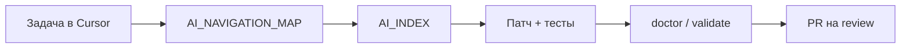

# Genetic AI Starter Kit

**Platform version:** `0.4.13` — aligned with `AGENTSTACK_CORE_VERSION` (monorepo) or `[PLATFORM_VERSION](PLATFORM_VERSION)` (standalone copy).

**Languages:** [English](README.en.md) · **Русский** (this file)

**Слой AI-операций для любого репозитория:** карта навигации, genetic tags, правила Cursor и genes в git — чтобы агент **сам** находил нужные файлы, не плодил дубликаты контуров, обновлял docs в PR и доходил до **merge-ready** без микроменеджмента «где лежит код». Токены экономятся как следствие map-first, а не как главный продукт.

**English (главная для GitHub):** [README.en.md](README.en.md) · **Kit:** [agentstacktech/genetic-ai-starter](https://github.com/agentstacktech/genetic-ai-starter) · **Платформа:** [agentstacktech/AgentStack](https://github.com/agentstacktech/AgentStack) · **npm:** `npx @agentstack/genetic-ai-starter init` · [Ссылки](meta/docs/REPOSITORY_LINKS.md)

**Genetic tag:** `repo.tooling.genetic_starter.gen1`

---

## Что даёт kit


| Без kit                                             | С kit                                                                                                                       |
| --------------------------------------------------- | --------------------------------------------------------------------------------------------------------------------------- |
| Каждый проект изобретает свои правила и `AGENTS.md` | Готовый **стандарт**: philosophy, карта, skills, merge `.cursorrules`                                                       |
| Агент ищет по всему `src/` и часто пишет «с нуля»   | **Map-first:** карта → index → 1–2 hot-файла, reuse существующего кода                                                      |
| Новый модуль без docs → через месяц хаос            | **Tier 1 + AI_INDEX** в том же PR, что код (задача T05 в бенчмарке)                                                         |
| Массовый `sed` / one-liner по дереву                | Gene **controlled changes** — отказ и scoped-патчи (T04)                                                                    |
| Релиз: забыли карту, route, validate                | Чеклист **map + index + doctor** (T13) — [AI_RELEASE_AUTONOMY_ru.md](meta/docs/AI_RELEASE_AUTONOMY_ru.md)                   |
| Нет общего языка для задач                          | **Genetic tags** в карте, PR и genes                                                                                        |
| Сломалась установка                                 | `doctor`, `repair`, `upgrade`, `validate-installed`                                                                         |
| Дешёвая модель даёт разброс по чатам                | **Пол в git:** weak harness **0%** → kit+idx **100%** успеха — [AGENT_FLOOR_ru.md](meta/docs/AGENT_FLOOR_ru.md)             |
| CI / lock / validate                                | sample workflow + `kit.lock.json` + `validate-installed` — [PRODUCTION_OUTCOMES_ru.md](meta/docs/PRODUCTION_OUTCOMES_ru.md) |


## Польза в продакшене


| Production risk          | Без kit          | С kit                                            |
| ------------------------ | ---------------- | ------------------------------------------------ |
| Wrong-module PR          | grep roulette    | map → index → hot file                           |
| Release без docs         | забыли route/map | T13 + doctor в CI                                |
| Дешёвые модели в команде | разброс          | [AGENT_FLOOR_ru.md](meta/docs/AGENT_FLOOR_ru.md) |
| Onboarding 2+ dev        | устные пути      | Tier 1 + genetic tags                            |
| AgentStack consumers     | MCP drift        | extension + sync-from-canonical                  |


Подробно: [PRODUCTION_OUTCOMES_ru.md](meta/docs/PRODUCTION_OUTCOMES_ru.md).

## AgentStack ecosystem (reference)

Цифры из `[platform-stats.snapshot.json](meta/docs/platform-stats.snapshot.json)` (regenerate: `node scripts/export-platform-stats.mjs`):

- **~222** active genes в monorepo philosophy
- **~98** `AI_INDEX.md` на платформенных пакетах (без CardGame)
- **~267** Tier-1 genetic tags в центральной карте
- Kit ships **~20** starter genes (8 foundation + navigation + engineering) + **5** Cursor rules + **5** skills (standard)
- Тот же Navigation OS, что в [AgentStack](https://github.com/agentstacktech/AgentStack) — [shared/AI_INDEX.md](../shared/AI_INDEX.md)

Harness-метрики shop-api — отдельно: `[metrics.snapshot.json](meta/docs/metrics.snapshot.json)`.

### AgentStack vs kit (из snapshot)


| Слой       | Monorepo AgentStack          | Установка kit       |
| ---------- | ---------------------------- | ------------------- |
| Genes      | ~222 `.gen1.md`              | ~20 стартовых genes (8 foundation) |
| `AI_INDEX` | ~98 на платформенных пакетах | заполняет ИИ сам    |
| Карта      | ~267 Tier-1 tags             | шаблон + ваш Tier 1 |
| Harness    | внутренний shop-api          | та же методология   |


### Кластеры genes (старт)

- **Foundation (читать первыми):** `foundation.core_pillars` → creation, minimalism, decomposition («слон по кускам»), absolute optimization, TDC, genetic coding, AI interface — long-form: `philosophy/principles/`, `philosophy/archive/FOUNDATION_HERITAGE_READING.md`
- **Навигация:** `repo.navigation.map`, `repo.navigation.index`
- **Инженерия:** `repo.engineering.controlled_changes`, `repo.engineering.adr`, `repo.engineering.testing`
- **Kit:** `repo.tooling.genetic_starter.`*
- **Founder:** `repo.engineering.founder_direct_ship`

См. [GENE_COMPRESSION_MAP.md](payload/philosophy/genes/GENE_COMPRESSION_MAP.md) после install. Maintainer sync: `node genetic-ai-starter/scripts/sync-from-canonical.mjs`.

## Релиз с ИИ — результат, не счётчик токенов

Kit нужен, чтобы **фича доезжала до PR и релиза**, а не чтобы «уменьшить цифру в отчёте».

**Что агент делает с kit (в git, не в чате):**

1. Открывает **канонический** путь (карта + index), а не legacy-decoy (T07).
2. Меняет **нужные** файлы, отказывается от bulk sed по `src/` (T04).
3. При новом модуле обновляет **AI_NAVIGATION_MAP** и **AI_INDEX** (T05).
4. Перед merge запускает **doctor / validate** (T13).

**Роль человека:** approve PR, продукт, security, prod deploy — не «найди файл в monorepo».




Подробно: [AI_RELEASE_AUTONOMY_ru.md](meta/docs/AI_RELEASE_AUTONOMY_ru.md) · [GENE_ADAPTATION_ru.md](meta/docs/GENE_ADAPTATION_ru.md).

## Слабый агент — стабильный результат (поднятие пола)

Kit **не заменяет** топовую модель на продуктовом дизайне и security. Он **выравнивает инженерный результат** на типовых задачах в репозитории: найти canonical-файл, не ломать `sed`-ом весь `src/`, обновить карту, пройти doctor.


| Ситуация                                                      | Медиана балла (14 задач) | Успех (≥6) |
| ------------------------------------------------------------- | ------------------------ | ---------- |
| Стиль «слабого» агента без карты (`agents_md_weak` в harness) | **2.5**                  | **0%**     |
| **Kit + индексы** (та же дисциплина + Navigation OS)          | **9**                    | **100%**   |


Сильная дорогая модель без kit часто «дотягивает» задачу brute-force grep — но с **разбросом** и перерасходом контекста. **Дешёвая модель + карта, genes и doctor** в harness стабильно попадает в коридор **T04 / T05 / T08 / T13** (например T05 **4→10**, T13 **4→10** у weak vs kit).

Подробно: [AGENT_FLOOR_ru.md](meta/docs/AGENT_FLOOR_ru.md) · [DOC_CLAIMS_AUDIT.md](meta/docs/DOC_CLAIMS_AUDIT.md).

## Что появится в вашем проекте

- **AGENTS.md** — контракт для агента: что читать и в каком порядке.
- **Карта и индексы** — `AI_NAVIGATION_MAP.md`, шаблоны, при необходимости `AI_INDEX.md` по подсистемам.
- **Philosophy / genes** — как мы меняем код, ADR, тесты, direct-ship (профиль `founder`).
- **Cursor** — 5 rules + 4 skills (standard), идемпотентный блок в `.cursorrules`.
- **Скрипты** — `new-gene.mjs`, doctor/repair; lock `.genetic-ai/kit.lock.json`.
- **Приватность** — `--gitignore-kit full`: файлы kit локально, не в git.
- **AgentStack (опционально)** — overlay MCP/8DNA для потребителей платформы.

## Крупные проекты (killer feature)

На scale ломается не «мало токенов», а **адресуемость**: агент плодит вторые auth/webhook/checkout, усиливает legacy, забывает обновить навигацию — проект становится неподдерживаемым.

**Что даёт Navigation OS:**


| Проблема на большом репо                                | Решение kit                                               |
| ------------------------------------------------------- | --------------------------------------------------------- |
| Тысячи файлов, контекст не влезает                      | **Tier 0** — с какого пакета начать                       |
| Дублирование подсистем                                  | **Tier 1 + genetic tag** — один canonical контур на смысл |
| Каждая фича «с нуля»                                    | **AI_INDEX** — hot files, reuse                           |
| Legacy-ловушки (`oldCheckout`, устаревший ARCHITECTURE) | Секция **Traps** в карте + index                          |
| Рост хаоса между релизами                               | **T13:** map + index + doctor в процессе                  |


Полный разбор: [KILLER_FEATURE_LARGE_PROJECTS_ru.md](meta/docs/KILLER_FEATURE_LARGE_PROJECTS_ru.md) · внедрение: [LARGE_PROJECT_PLAYBOOK.md](meta/docs/LARGE_PROJECT_PLAYBOOK.md).

## Замеры (бенчмарк harness)

**Что это:** воспроизводимый стенд `shop-api`, **14** задач (discovery, maintenance, release gate), scorer **1.2.1**. Транскрипты **синтетические** — моделируют поведение агента, это не среднее по всем чатам Cursor. Запуск: [BENEFITS_AND_METRICS_ru.md](meta/docs/BENEFITS_AND_METRICS_ru.md).

### Что такое «балл задачи» (0–10)

За каждую задачу scorer суммирует рубрику (макс. **10**):


| Измерение        | Смысл                                        |
| ---------------- | -------------------------------------------- |
| Правильные файлы | Упомянуты gold-файлы, не legacy-decoy        |
| Путь навигации   | Сначала карта / index / gene, не слепой grep |
| Дисциплина scope | Без repo-wide `rg` по всему `src/`           |
| Результат        | Задача решена или опасная команда отклонена  |
| Эффективность    | Меньше лишних tool-hop до цели               |


**Успех задачи** = балл **≥ 6**. **Медиана балла** — середина по 14 задачам (одна проваленная discovery тянет картину — смотрите ещё **% успеха** и задачи T04/T05/T13).

Подробнее: [METRICS_GLOSSARY.md](meta/docs/METRICS_GLOSSARY.md).

### Сводка по arms (актуально после `run-matrix`)


| Arm                      | Медиана балла | Успех задач (≥6) | Map-first (genetic) |
| ------------------------ | ------------- | ---------------- | ------------------- |
| bare (только README)     | 5.5           | 50%              | 0%                  |
| agents_md_weak *         | 2.5           | 0%               | 0%                  |
| agents_md (optimistic) * | 7             | 86%              | **7%**              |
| **kit standard**         | **8**         | **93%**          | **50%**             |
| **kit + индексы**        | **9**         | **100%**         | **86%**             |


 **agents_md** в таблице — не «ваш один AGENTS.md в проде». Это benchmark-arm: файл [agents.md.only](benchmarks/baselines/agents.md.only) + **заранее оптимистичный** транскрипт («нашёл файл», без map maintenance). Arm **agents_md_weak** — тот же файл, но транскрипт с grep/sed как у слабого агента (медиана **2.5**). Реальная сессия обычно **между** ними; **медиана 8 у agents_md завышена для сравнения**, потому что нет карты Tier 1 и genetic map-first всего **7%** — при провале T08 (5) и T13 (5).

**Профиль `minimal` при install** ≠ arm `agents_md` (у minimal есть rules + stub map). См. [PROFILE_COMPARISON.md](meta/docs/PROFILE_COMPARISON.md).

### Задачи, по которым сравнивать kit (результат важнее медианы)


| Задача  | Смысл для продукта              | bare  | kit + индексы |
| ------- | ------------------------------- | ----- | ------------- |
| **T04** | Отказ от `sed` по всему `src/`  | 2     | **8**         |
| **T05** | Новый модуль → map + index      | 4     | **10**        |
| **T07** | Checkout, не legacy decoy       | 1     | **7**         |
| **T08** | Баг каталога, правильный файл   | 7     | **10**        |
| **T13** | Pre-release: map, index, doctor | низко | **10**        |


### Токены (вторичная метрика)

Step-модель контекста на shop-api: bare **~2.3k** / задачу (медиана), kit + индексы **~1.1k**; на discovery **~3.0k → ~1.1k** (~2.5–3×). Это **не** счёт Cursor API. Детали: [TOKEN_ECONOMICS_ru.md](meta/docs/TOKEN_ECONOMICS_ru.md) · [TOKEN_REPORT.md](benchmarks/results/TOKEN_REPORT.md).

### Неделя с kit (результат)


| День | Что происходит                         |
| ---- | -------------------------------------- |
| 0    | `init --profile standard`              |
| 1    | Tier 0/1 в `AI_NAVIGATION_MAP.md`      |
| 2    | Агент чинит баг по map-first (как T08) |
| 3    | Новый модуль: код + map + index (T05)  |
| 4    | `doctor` → PR без «забыли карту» (T13) |


ROI и профили: [ROI_PLAYBOOK.md](meta/docs/ROI_PLAYBOOK.md) · [PROFILE_COMPARISON.md](meta/docs/PROFILE_COMPARISON.md).

## Документация


| Doc                                                                          | Purpose                                                 |
| ---------------------------------------------------------------------------- | ------------------------------------------------------- |
| **[DOC_HUB.md](meta/docs/DOC_HUB.md)**                                       | **Индекс всей документации kit**                        |
| **[SETUP.cmd](SETUP.cmd)**                                                   | **Мастер установки (Windows)**                          |
| [meta/docs/QUICK_SETUP.md](meta/docs/QUICK_SETUP.md)                         | 3 шага для пользователя                                 |
| **[meta/docs/INSTALL.md](meta/docs/INSTALL.md)**                             | **Canonical install guide**                             |
| [meta/docs/INSTALL_WINDOWS.md](meta/docs/INSTALL_WINDOWS.md)                 | Windows (CMD / Node; без ``` и без PSSecurityException) |
| [meta/docs/TROUBLESHOOTING.md](meta/docs/TROUBLESHOOTING.md)                 | Error catalog                                           |
| [meta/docs/PRODUCTION_OUTCOMES_ru.md](meta/docs/PRODUCTION_OUTCOMES_ru.md)   | **Польза в продакшене**                                 |
| [meta/docs/AGENT_FLOOR_ru.md](meta/docs/AGENT_FLOOR_ru.md)                   | **Слабый агент → стабильный результат**                 |
| [meta/docs/DOC_CLAIMS_AUDIT.md](meta/docs/DOC_CLAIMS_AUDIT.md)               | Доказательная база claims                               |
| [meta/docs/BENEFITS_AND_METRICS_ru.md](meta/docs/BENEFITS_AND_METRICS_ru.md) | **Замеры и примеры задач**                              |
| [meta/docs/GETTING_STARTED.md](meta/docs/GETTING_STARTED.md)                 | Short overview                                          |
| [COMMUNITY_ru.md](COMMUNITY_ru.md)                                           | Сообщество (RU)                                         |
| [FAQ.md](FAQ.md)                                                             | Частые вопросы                                          |
| [VERSION.md](VERSION.md)                                                     | Versioning policy                                       |


---

## Зачем (одной фразой)

**Довести фичу до merge-ready PR** — карта, genes и doctor в git; даже **слабый** агент стабильно попадает в процесс (см. [AGENT_FLOOR_ru.md](meta/docs/AGENT_FLOOR_ru.md)), без микроменеджмента путей. Токены — побочный эффект map-first.

## Not the same as


| Package                                           | Role                                   |
| ------------------------------------------------- | -------------------------------------- |
| `[8DNA_EXPORT_PACKAGE/](../8DNA_EXPORT_PACKAGE/)` | Heritage / patents / 8DNA architecture |
| **genetic-ai-starter**                            | Day-to-day AI ops for any new project  |


---

## Установка


| Путь | Команда |
| ---- | ------- |
| **Submodule (рекомендуется)** | `git submodule add https://github.com/agentstacktech/genetic-ai-starter.git tools/genetic-ai-starter` → `node tools/genetic-ai-starter/scripts/bootstrap-standard.mjs --target . --project-name "My App" --domain app` |
| npm / zero-kit | `npx @agentstack/genetic-ai-starter init --yes --target ./my-app --profile standard --project-name "My App" --domain app` |
| Windows | [SETUP.cmd](SETUP.cmd) или [bootstrap-standard.cmd](scripts/bootstrap-standard.cmd) |

Полный гайд: [INSTALL.md](meta/docs/INSTALL.md) · [QUICK_SETUP.md](meta/docs/QUICK_SETUP.md) · [INTEGRATION_MODES.md](meta/docs/INTEGRATION_MODES.md) · [INSTALL_WINDOWS.md](meta/docs/INSTALL_WINDOWS.md).

**После install:** заполните `docs/ai/AI_NAVIGATION_MAP.md`, добавьте `AI_INDEX.md` на крупные подсистемы, `node tools/genetic-ai-starter/scripts/doctor.mjs --target .`.

---

## Maintainers (AgentStack monorepo)

```bash
node genetic-ai-starter/scripts/sync-kit-version.mjs
node genetic-ai-starter/scripts/validate-kit.mjs
node genetic-ai-starter/tests/install.test.mjs
node genetic-ai-starter/tests/verify-temp-install.test.mjs
```

See [MAINTAINERS.md](MAINTAINERS.md).

---

## English

[README.en.md](README.en.md) · [LICENSE_NOTICE.md](LICENSE_NOTICE.md)