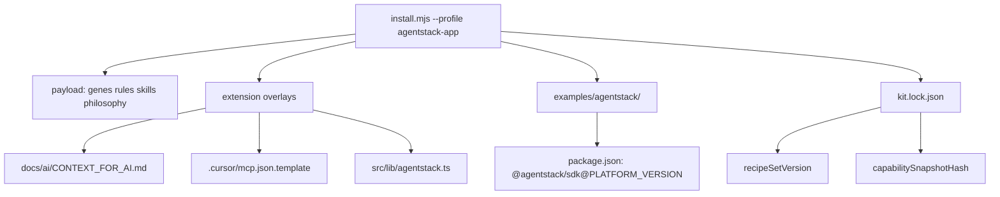

# AgentStack app profile — consumer guide

**Genetic tag:** `repo.tooling.genetic_starter.agentstack_dx.gen1`  
**RU:** [AGENTSTACK_APP_GUIDE_ru.md](AGENTSTACK_APP_GUIDE_ru.md)  
**Profile matrix:** [PROFILE_COMPARISON.md](PROFILE_COMPARISON.md) § agentstack-app

Use profile **`agentstack-app`** when you build a **product on AgentStack** (SDK, MCP, 8DNA) — not when you only contribute to the AgentStack monorepo itself (`founder`).

---

## What installs (data flow)



| Path after install | Purpose |
|--------------------|---------|
| `docs/ai/CONTEXT_FOR_AI.md` | Channel preference, intent→domain, scopes |
| `docs/ai/agentstack-capability-snapshot.json` | Offline MCP/SDK contract |
| `src/lib/agentstack.ts` | `catalog()`, `capabilities()`, `ensureScope()` |
| `.cursor/mcp.json.template` | MCP URL + `${AGENTSTACK_ACCESS_TOKEN}` |
| `.cursor/rules/agentstack-sdk-first.mdc` | sdk.protocol, no sdk.admin |
| `examples/agentstack/` | Recipes 00–11 + `SDK_ACQUISITION.md` |
| `.genetic-ai/kit.lock.json` | `profile`, `recipeSetVersion`, `recipeLang` |

---

## Install paths

### Submodule kit (recommended)

```bash
git submodule add https://github.com/agentstacktech/genetic-ai-starter.git tools/genetic-ai-starter
node tools/genetic-ai-starter/scripts/install.mjs \
  --target . \
  --profile agentstack-app \
  --project-name "My App" \
  --domain app \
  --strict \
  --record-kit-source
```

### Wizard

```bash
node tools/genetic-ai-starter/scripts/init.mjs --target .
# Choose profile agentstack-app → language TypeScript or Python
```

### npm zero-kit

```bash
npx @agentstack/genetic-ai-starter init --profile agentstack-app --target ./my-app --yes
```

---

## Flow A — npm SDK (default)

Printed by install after copy:

```bash
cd examples/agentstack
npm install @agentstack/sdk@0.4.15   # matches PLATFORM_VERSION
npm run recipe:00-bootstrap
```

Environment:

| Variable | Purpose |
|----------|---------|
| `AGENTSTACK_API_BASE` | REST API base |
| `AGENTSTACK_EMAIL` / `AGENTSTACK_PASSWORD` | Login (recipe 00) |
| `AGENTSTACK_PROJECT_ID` | Active project scope |
| `AGENTSTACK_API_KEY` | MCP fetch recipes (03, 06, 09, 11) |
| `AGENTSTACK_ACCESS_TOKEN` | MCP in Cursor (from `/agentstack-init`) |

---

## Flow B — SDK git submodule

```bash
node tools/genetic-ai-starter/scripts/submodule-add-sdk.mjs --target . --tag v0.4.15
node tools/genetic-ai-starter/scripts/link-sdk-deps.mjs --target .
cd vendor/agentstack-sdk && npm install && npm run build
cd examples/agentstack && npm install
npm run recipe:00-bootstrap
```

See [examples/agentstack/SDK_ACQUISITION.md](../../extensions/agentstack/recipes/SDK_ACQUISITION.md) after install.

---

## MCP token (single source of truth)

1. Run Cursor plugin **`/agentstack-init`** (device code OAuth).
2. Plugin writes Bearer to `~/.cursor/mcp.json`.
3. Kit template uses **`AGENTSTACK_ACCESS_TOKEN`** — never commit literals.

---

## Health checks

```bash
node tools/genetic-ai-starter/scripts/doctor.mjs --target .
node tools/genetic-ai-starter/scripts/check-capability-contract.mjs --target .
```

Upgrade (refreshes overlays + recipes):

```bash
node tools/genetic-ai-starter/scripts/upgrade.mjs --target .
```

---

## Python recipes

```bash
node tools/genetic-ai-starter/scripts/install.mjs --target . --profile agentstack-app --lang python
# Recipes → examples/agentstack-python/
```

---

## ROI for this profile

Incremental **~$1,400/mo** modeled savings vs `standard` alone — **~$2,450/mo total** with a small team ([VALUE_AND_ROI_BY_PROJECT_SIZE.md](VALUE_AND_ROI_BY_PROJECT_SIZE.md)).

---

## Links

| Doc | |
|-----|---|
| Extension README | [extensions/agentstack/README.md](../../extensions/agentstack/README.md) |
| Recipe index | [extensions/agentstack/recipes/AI_INDEX.md](../../extensions/agentstack/recipes/AI_INDEX.md) |
| ADR | [docs/adr/GENETIC_STARTER_AGENTSTACK_DX.md](../../../docs/adr/GENETIC_STARTER_AGENTSTACK_DX.md) (monorepo) |
