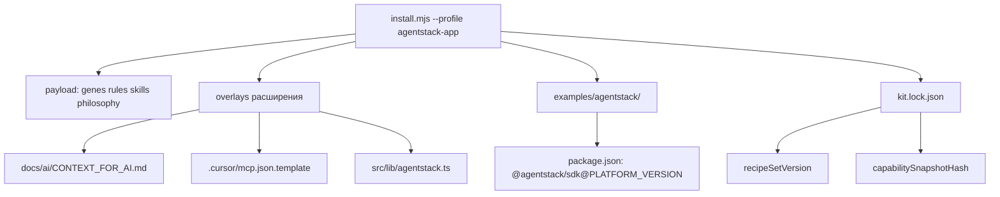

# Профиль agentstack-app — гайд для потребителя

**Genetic tag:** `repo.tooling.genetic_starter.agentstack_dx.gen1`  
**EN:** [AGENTSTACK_APP_GUIDE.md](AGENTSTACK_APP_GUIDE.md)  
**Матрица профилей:** [PROFILE_COMPARISON.md](PROFILE_COMPARISON.md) § agentstack-app

Профиль **`agentstack-app`** — когда вы строите **продукт на AgentStack** (SDK, MCP, 8DNA), а не когда вы коммитите в monorepo платформы (`founder`).

---

## Что устанавливается (поток данных)



| Путь после install | Назначение |
|--------------------|------------|
| `docs/ai/CONTEXT_FOR_AI.md` | Каналы, intent→domain, scopes |
| `docs/ai/agentstack-capability-snapshot.json` | Офлайн-контракт MCP/SDK |
| `src/lib/agentstack.ts` | `catalog()`, `capabilities()`, `ensureScope()` |
| `.cursor/mcp.json.template` | MCP + `${AGENTSTACK_ACCESS_TOKEN}` |
| `.cursor/rules/agentstack-sdk-first.mdc` | sdk.protocol, без sdk.admin |
| `examples/agentstack/` | Recipes 00–11 + `SDK_ACQUISITION.md` |
| `.genetic-ai/kit.lock.json` | `profile`, `recipeSetVersion`, `recipeLang` |

---

## Установка

### Submodule kit (рекомендуется)

```bash
git submodule add https://github.com/agentstacktech/genetic-ai-starter.git tools/genetic-ai-starter
node tools/genetic-ai-starter/scripts/install.mjs \
  --target . \
  --profile agentstack-app \
  --project-name "My App" \
  --domain app \
  --strict \
  --record-kit-source
```

### Мастер init

```bash
node tools/genetic-ai-starter/scripts/init.mjs --target .
# Профиль agentstack-app → язык TypeScript или Python
```

---

## Flow A — npm SDK (по умолчанию)

После install:

```bash
cd examples/agentstack
npm install @agentstack/sdk@0.4.13
npm run recipe:00-bootstrap
```

Переменные окружения — см. [SDK_ACQUISITION.md](../../extensions/agentstack/recipes/SDK_ACQUISITION.md).

---

## Flow B — submodule SDK

```bash
node tools/genetic-ai-starter/scripts/submodule-add-sdk.mjs --target . --tag v0.4.13
node tools/genetic-ai-starter/scripts/link-sdk-deps.mjs --target .
cd vendor/agentstack-sdk && npm install && npm run build
cd examples/agentstack && npm install
npm run recipe:00-bootstrap
```

---

## Токен MCP (один источник правды)

1. Плагин Cursor **`/agentstack-init`** (device code).
2. Bearer в `~/.cursor/mcp.json`.
3. Шаблон kit — **`AGENTSTACK_ACCESS_TOKEN`**, без литералов в git.

---

## Проверки

```bash
node tools/genetic-ai-starter/scripts/doctor.mjs --target .
node tools/genetic-ai-starter/scripts/check-capability-contract.mjs --target .
node tools/genetic-ai-starter/scripts/upgrade.mjs --target .
```

---

## Python

```bash
node tools/genetic-ai-starter/scripts/install.mjs --target . --profile agentstack-app --lang python
```

---

## ROI

Дополнительно **~$1 400/мес** к `standard` (итого **~$2 450/мес** с малой командой) — [VALUE_AND_ROI_BY_PROJECT_SIZE_ru.md](VALUE_AND_ROI_BY_PROJECT_SIZE_ru.md).

---

## Ссылки

| Документ | |
|----------|---|
| README расширения | [extensions/agentstack/README.md](../../extensions/agentstack/README.md) |
| Индекс recipes | [extensions/agentstack/recipes/AI_INDEX.md](../../extensions/agentstack/recipes/AI_INDEX.md) |
