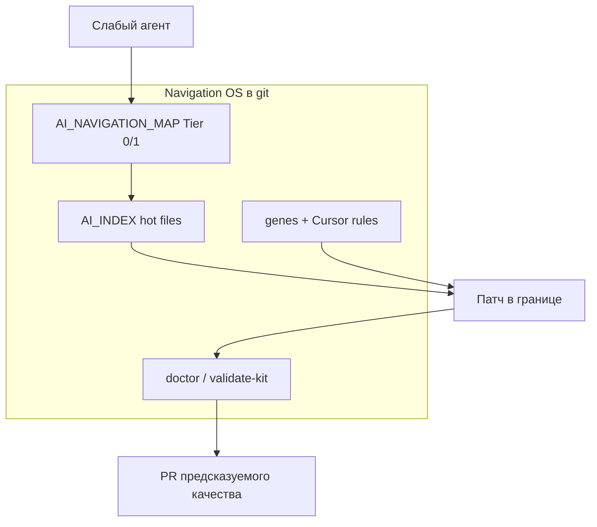

# Поднятие пола: слабый агент — стабильный инженерный результат

**EN:** [AGENT_FLOOR.md](AGENT_FLOOR.md)

**Genetic tag:** `repo.tooling.genetic_starter.agent_floor.gen1`

**Связано:** [METRICS_GLOSSARY.md](METRICS_GLOSSARY.md) · arm `agents_md_weak` · [AI_RELEASE_AUTONOMY_ru.md](AI_RELEASE_AUTONOMY_ru.md) · [BENEFITS_AND_METRICS_ru.md](BENEFITS_AND_METRICS_ru.md)

---

## Тезис в одном абзаце

Genetic AI Starter Kit **не превращает** дешёвую модель в «магически умную». Он **поднимает нижнюю границу** на типовых задачах в репозитории: найти canonical-файл, не устроить `sed` по всему `src/`, обновить карту при новом модуле, пройти doctor перед merge. На этих задачах **слабый агент с kit** в harness даёт **стабильно высокие баллы** (у **kit + индексов** — **100%** успешных задач, медиана **9**), тогда как **тот же стиль поведения без kit** (`agents_md_weak`) — **0%** успеха и медиана **2.5**. Сильная дорогая модель без карты часто «дотягивает» разовую задачу brute-force grep, но с **большой дисперсией** и перерасходом контекста.

---

## Что мы имеем в виду под «слабым агентом»

| В реальной команде | В benchmark harness |
|--------------------|---------------------|
| Быстрая / дешёвая модель в Cursor | Arm **`agents_md_weak`** |
| Агент, который сразу `rg` по всему `src/` | Транскрипт: grep-first, `sed`, без map maintenance |
| Сессия без памяти о вчерашнем PR | Нет Tier 1 / `AI_INDEX` / genes в репо |
| «Нашёл похожий файл» → патч не туда | T07 legacy decoy, T08 repo-wide search |

**Важно:** «слабость» здесь — про **дисциплину навигации и процесса**, не про IQ на абстрактной математике.

---

## Что мы **не** обещаем

| Не это | Почему |
|--------|--------|
| «Mini-модель = Opus на всём» | Архитектура продукта, security trade-offs, новые домены — остаются за человеком |
| «100% без review» | Kit ведёт к **merge-ready PR**; approve — у вас |
| «Любой чат без чтения AGENTS» | Контракт в `AGENTS.md` и rules должен попасть в контекст агента |
| Гарантия по одному чату | Harness — **синтетика**; на своём репо — [benchmarks/METHODOLOGY.md](../../benchmarks/METHODOLOGY.md) § Manual validation |

---

## Что мы **обещаем** (область применения)

**Repo-bound инженерия** — задачи, где успех измерим:

- правильный файл и путь (T01, T07, T08);
- отказ от опасной массовой правки (T04);
- сопровождение навигации при росте кода (T05);
- release gate: карта + index + doctor (T13).

Именно здесь kit даёт **рельсы**: сужает поиск, включает отказы и чеклисты в git.

---

## Доказательство из harness (scorer 1.2.1, 14 задач)

Сравнение **одного и того же «плохого» стиля агента** vs **тот же стиль + Navigation OS**:

| Метрика | `agents_md_weak` (слабый стиль, только AGENTS) | **kit + индексы** |
|---------|-----------------------------------------------|-------------------|
| Медиана балла | **2.5** | **9** |
| Успех задач (≥6) | **0%** | **100%** |
| Map-first (genetic) | **0%** | **86%** |
| Нецелевой grep (14 задач) | **16** | **0** |

**Дельта kit standard − agents_md_weak:** медиана **+5.5**, успех **+50 п.п.** (см. [ANALYSIS.md](../../benchmarks/results/ANALYSIS.md)).

### Задачи, где «слабый» проваливается, а kit стабильно держит уровень

| Задача | Смысл | agents_md_weak | kit + индексы |
|--------|-------|----------------|---------------|
| **T01** | Prod entrypoint, не dev-trap | 2 | **10** |
| **T04** | Не `sed` по всему `src/` | 2 | **8** |
| **T05** | Новый модуль → map + index | 4 | **10** |
| **T07** | Checkout, не legacy | 1 | **7** |
| **T08** | Баг каталога, scoped path | 4 | **10** |
| **T13** | Pre-release doctor | 4 | **10** |

Оптимистичный arm **`agents_md`** (медиана **8**, но map-first genetic **7%**) показывает обратную ловушку: **высокий средний балл без карты** не равен **стабильному процессу** — провалы T08/T13 остаются.

---

## Почему это похоже на «уровень топ-модели» (и где граница)

### Стабильность важнее пика

| Паттерн | bare / слабый стиль | Сильная модель без kit | **Слабая модель + kit** |
|---------|---------------------|-------------------------|-------------------------|
| T04 bulk sed | часто провал | иногда откажет, иногда нет | **gene + rule → стабильный отказ** |
| T05 map при новом модуле | 4/10 | может забыть | **10/10** в harness |
| Дисперсия между задачами | высокая (50% success bare) | средняя | **низкая** на checklist-задачах |
| Стоимость сессии | много grep | много grep + большой контекст | **map-first → меньше hop** |

**Топовая дорогая модель** без Navigation OS часто решает задачу «в лоб»: больше токенов, больше tool calls, иногда угадывает legacy. **Слабая модель + kit** чаще идёт **коротким маршрутом** из карты — результат на **процессных** KPI близок к сильной, но **без** постоянного перерасхода и **без** зависимости от удачи в одном чате.

### Четыре слоя «рельс»

1. **Сужение поиска** — не 40 кандидатов из `rg`, а 1–2 hot files (T08: **4 → 10**).
2. **Жёсткие запреты** — `controlled_changes` на T04 (**2 → 8** у weak vs kit).
3. **Память в git** — genes и карта переживают новый чат; не «вчера говорили в Slack».
4. **Ворота перед merge** — T13: map + index + doctor (**4 → 10**).

### Аналогия для команды

Как **типы + линтер + CODEOWNERS** не делают джуниора сеньором, но **режут класс багов** — так kit режет класс **навигационных** и **процессных** ошибок агента. Сильный разработчик без conventions всё ещё может наступить на rake; слабый **с conventions** — реже.

---

## Практика: как получить эффект в проде

| Шаг | Действие |
|-----|----------|
| 1 | `init --profile standard` — карта, rules, genes, не только AGENTS |
| 2 | Заполнить Tier 0/1 под **ваши** пакеты |
| 3 | `AI_INDEX.md` на горячих подсистемах (~10+ интеграций) |
| 4 | В PR: «агент обновил map/index?» + `doctor` в CI |
| 5 | Доказательство на **вашей** модели — [benchmarks/METHODOLOGY.md](../../benchmarks/METHODOLOGY.md) § Manual validation |

**Минимальный профиль** уже поднимает T04/T05 vs community AGENTS, но **полный пол** — standard + индексы ([PROFILE_COMPARISON.md](PROFILE_COMPARISON.md)).

---

## Ограничения (честно)

- Harness моделирует **affordances** репозитория, не все варианты ответа живой модели.
- Если агент **игнорирует** `AGENTS.md` и rules, рельс нет — нужен выбор модели/режима в IDE.
- Творческий дизайн API, сложные trade-offs, инциденты на проде — **человек + сильная модель**, kit как страховка от хаоса в коде.

---

## См. также

- [DOC_CLAIMS_AUDIT.md](DOC_CLAIMS_AUDIT.md) — evidence vs marketing  
- [REAL_BENEFITS_ru.md](REAL_BENEFITS_ru.md) — польза целиком  
- [COMPARISON_METHODS.md](COMPARISON_METHODS.md) — vs AGENTS-only / RAG  
- [TOKEN_ECONOMICS_ru.md](TOKEN_ECONOMICS_ru.md) — почему стабильность ещё и дешевле по контексту
