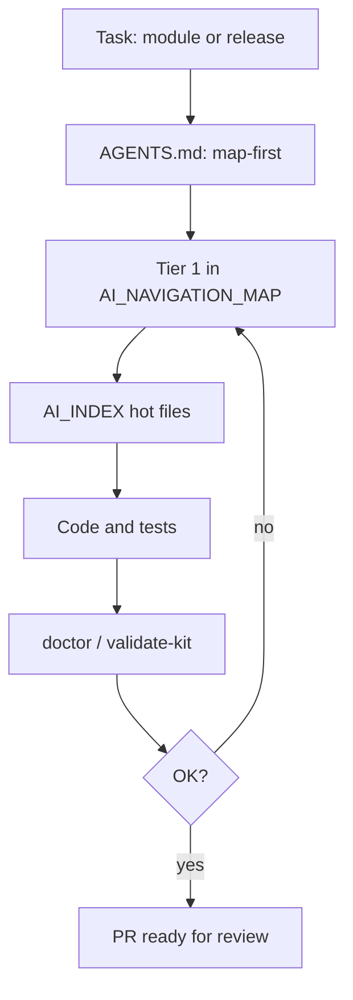

# AI-assisted release — genes, map, validation

**RU:** [AI_RELEASE_AUTONOMY_ru.md](AI_RELEASE_AUTONOMY_ru.md)

**Related:** [GENE_ADAPTATION.md](GENE_ADAPTATION.md) · [TOKEN_ECONOMICS.md](TOKEN_ECONOMICS.md) · harness task **T13**

---

## What “ship to release without micromanaging paths” means

Not zero humans on prod, and not “saved N tokens on a dashboard.” The goal is a **merge-ready PR** without constant “where is the code?” and “why did we patch legacy again?”

An agent with kit in **git** (not chat memory):

1. Finds **canonical** files via map + index — not `oldCheckout` or stale ARCHITECTURE (T07, T14).
2. Edits **in scope** — refuses bulk `sed` / PowerShell across the tree (T04, S03).
3. On a new module, adds **Tier 1** and **AI_INDEX** in the **same PR** as code (T05).
4. Before merge — **doctor** / **validate-kit** (T13).

Humans stay on **PR approval**, product, security, and prod deploy.

**Weak models:** on these steps kit raises **process stability** — harness weak-style without a map **0%** task success vs **100%** with kit + indexes ([AGENT_FLOOR.md](AGENT_FLOOR.md)).

---

## How genes simplify complex work

| Complexity | Without gene | With gene |
|------------|--------------|-----------|
| Mass refactor | `sed` on `src/` | `repo.engineering.controlled_changes` → scoped patches |
| Dual-shell route | `App.tsx` only | pages map gene → **PAGES_MAP** + parity |
| Many philosophy files | read all | `GENE_COMPRESSION_MAP` → 2–3 genes |
| New module | README only | `repo.navigation.index` → Tier 1 + **AI_INDEX** |
| Release | chat memory | **T13:** map + index + **doctor** + **validate-kit** |

Genes are **versioned instructions in git**, not ephemeral chat.

---

## Release pipeline (agent + kit)

**Harness T13** scores transcripts that name `AI_NAVIGATION_MAP`, `AI_INDEX`, `doctor`, and `validate` — otherwise score &lt;6.

---

## Why this scales on large repos

- **Stable address:** genetic tag, not “some folder in src”
- **Traps in map:** legacy paths marked decoy (T07, T14)
- **Indexes:** hot table instead of re-reading whole packages (T08, T12)

---

## Limitations

| Kit does not replace | Human / CI still needed |
|----------------------|-------------------------|
| Product decisions | PM / founder |
| Security sign-off | Security review |
| Live Cursor proof | [benchmarks/METHODOLOGY.md](../../benchmarks/METHODOLOGY.md) § Manual validation |
| Browser E2E | Playwright / QA |

---

## Pre-merge checklist

1. Code touches genetic tag from map?
2. **Map** + **index** updated for new subsystems?
3. `node scripts/validate-kit.mjs` or project `doctor`?
4. No bulk sed / mass rename one-liner (T04, S03)?

---

## Genes

- `repo.tooling.genetic_starter.gen1`
- `repo.engineering.controlled_changes.gen1`
- `repo.navigation.index.gen1`
- `foundation.ai_gene_interface.gen1`
