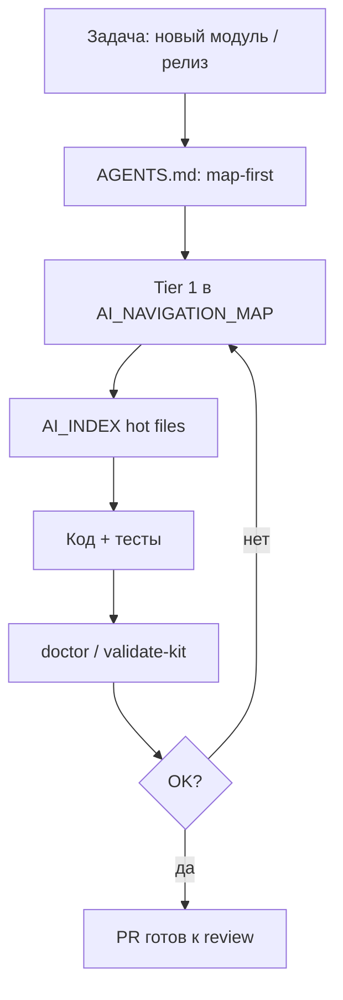

# Релиз с ИИ — genes, карта и автономные проверки

**EN:** [AI_RELEASE_AUTONOMY.md](AI_RELEASE_AUTONOMY.md)

**Связано:** [GENE_ADAPTATION_ru.md](GENE_ADAPTATION_ru.md) · [TOKEN_ECONOMICS_ru.md](TOKEN_ECONOMICS_ru.md) · задача harness **T13**

---

## Что значит «довести до релиза без человека»

Речь не о **нулевом** человеке на проде и не о «сэкономили N токенов в отчёте». Речь о том, что **фича доезжает до merge-ready PR** без постоянных уточнений «где лежит код» и «почему опять сломали legacy».

Агент с kit в git (не в памяти чата):

1. Находит **canonical** файлы по карте и index — не `oldCheckout` и не устаревший ARCHITECTURE (harness T07, T14).
2. Вносит изменение **в границе** — отказывается от bulk `sed` / PowerShell по дереву (T04, S03).
3. При новом модуле добавляет **Tier 1** и **AI_INDEX** в **том же PR**, что код (T05).
4. Перед merge — **doctor** / **validate-kit** (T13).

Человек остаётся на **approve PR**, продуктовых решениях и prod deploy. Вы не «дёргаете» агента по каждому пути в `src/`.

**Слабая модель:** на этих шагах kit поднимает **стабильность** процесса — в harness weak-style без карты **0%** успеха, с kit + индексами **100%** ([AGENT_FLOOR_ru.md](AGENT_FLOOR_ru.md)).

---

## Как genes делают сложные задачи проще

| Сложность | Без gene | С gene |
|-----------|----------|--------|
| Массовый рефакторинг | sed по `src/` | `repo.engineering.controlled_changes` → scoped patches |
| Dual-shell route | только `App.tsx` | `frontend.spa.dual_shell.pages_map` → **PAGES_MAP** + parity |
| 10+ philosophy файлов | читать подряд | `GENE_COMPRESSION_MAP` → 2–3 genes |
| Новый модуль | README | `repo.navigation.index` → map Tier 1 + **AI_INDEX** |
| Релиз | «надеемся на память чата» | **T13:** map + index + **doctor** + **validate-kit** |

Genes — **версионируемые инструкции в git**, не ephemeral chat memory.

---

## Конвейер релиза (агент + kit)

**Harness T13** проверяет, что транскрипт называет: `AI_NAVIGATION_MAP`, `AI_INDEX`, `doctor`, `validate` — иначе балл &lt;6.

---

## Почему это работает на больших репо

- **Стабильный адрес:** `shop.webhooks.gen1`, не «папка где-то в src».
- **Ловушки в карте:** legacy paths помечены decoy (T07, T14).
- **Индексы:** агент не перечитывает весь пакет — только hot table (T08, T12).

---

## Ограничения (честно)

| Не заменяет kit | Нужно человеку / CI |
|-----------------|---------------------|
| Продуктовые решения | PM / founder |
| Security sign-off | Security review |
| Реальный Cursor export | [benchmarks/METHODOLOGY.md](../../benchmarks/METHODOLOGY.md) § Manual validation |
| E2E в браузере | Playwright / QA |

---

## Быстрый чеклист перед merge

1. Код затронул genetic tag из карты?
2. Обновлены **map** + **index** (если новая подсистема)?
3. `node scripts/validate-kit.mjs` (или project `doctor`)?
4. Нет bulk sed / mass rename one-liner (T04, S03)?

---

## Genes

- `repo.tooling.genetic_starter.gen1`
- `repo.engineering.controlled_changes.gen1`
- `repo.navigation.index.gen1`
- `foundation.ai_gene_interface.gen1`
