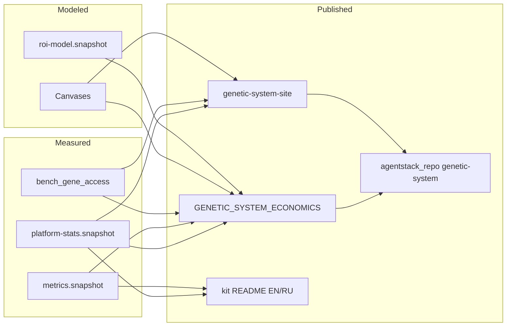

# Documentation data flow — Genetic System

**Genetic tag:** `repo.tooling.genetic_starter.docs_flow.gen1`

Single map of **where numbers and narratives come from**, how they flow into public docs, and which file wins on conflict.

---

## Source of truth (SoT) by claim type

| Claim type | SoT artifact | Regenerate / update |
|------------|--------------|---------------------|
| Platform inventory (genes, indexes, Tier-1 tags, kit payload) | [platform-stats.snapshot.json](platform-stats.snapshot.json) | `node scripts/export-platform-stats.mjs` |
| Harness scores (weak → kit+idx, per-task) | [metrics.snapshot.json](metrics.snapshot.json) | `node scripts/export-metrics-snapshot.mjs` after `run-matrix` |
| Philosophy compression **12.36×** | AgentStack `philosophy/bench_gene_access.json` | Platform bench script (monorepo) |
| Modeled $/year by team size | [roi-model.snapshot.json](roi-model.snapshot.json) | `node scripts/calculate-roi.mjs --export` |
| Marketing-safe claim ↔ evidence | [DOC_CLAIMS_AUDIT.md](DOC_CLAIMS_AUDIT.md) | Manual when claims change |
| Interactive narrative (RU/EN/PT) | Monorepo `docs/genetic-system-site/` | Edit locales + HTML; keep inventory aligned with snapshot |
| Canvas working models | Cursor canvases (economics / release / SDK leverage) | Synthesize into [GENETIC_SYSTEM_ECONOMICS.md](GENETIC_SYSTEM_ECONOMICS.md) — never cite canvas as SoT alone |
| Public integrator docs | `agentstack_repo/docs/genetic-system/` | Hand-authored; follow `docs/PUBLIC_DOCS_POLICY.md` |

---

## Data flow (read left → right)

---

## Conflict rules (best practice)

1. **Inventory numbers** in README / economics / killer-feature docs **must match** the latest `platform-stats.snapshot.json` fields — not canvas prose, not site HTML hardcodes alone.
2. After regenerating the snapshot, update: `README.md`, `README.en.md`, `GENETIC_SYSTEM_ECONOMICS*.md`, `KILLER_FEATURE_LARGE_PROJECTS*.md`, `DOC_CLAIMS_AUDIT.md`, and site hero/stat hardcodes if they diverge.
3. **Harness** numbers never replace inventory (and vice versa). Always label scope.
4. **12.36×** is philosophy access only — never “12× faster development.”
5. Public mirror (`agentstack_repo`) must not contain forbidden internal paths (`philosophy/genes/`, `agentstack-core/`, …) — see monorepo `docs/PUBLIC_DOCS_POLICY.md`.
6. Canvases inform narrative; **DOC_CLAIMS_AUDIT** gates what we claim in marketing copy.

---

## Current inventory (after 2026-07-10 export)

| Field | Value |
|-------|-------|
| `philosophyGenes` | 406 |
| `aiIndexFilesRepoTotal` | 186 |
| `aiIndexFilesPlatform` | 162 |
| `navigationMapTier1Tags` | 421 |
| `kitPayloadGenes` | 27 |
| `kitCursorRulesStandard` | 5 |
| `kitCursorSkillsStandard` | 10 |

Site narrative extras (not in snapshot): cross-cluster SYN **~16**, compression **12.36×** / **12.4×** display.

---

## Link / CI gates

| Check | Command |
|-------|---------|
| Doc hub + economics links | `node scripts/check-doc-hub-links.mjs` |
| Claims vs snapshots | Manual + [DOC_CLAIMS_AUDIT.md](DOC_CLAIMS_AUDIT.md) |
| ROI model | `node scripts/check-roi-model.mjs` |

---

## See also

- [DOC_HUB.md](DOC_HUB.md)
- [GENETIC_SYSTEM_ECONOMICS.md](GENETIC_SYSTEM_ECONOMICS.md)
- [DOC_MAINTENANCE_TASKS.md](DOC_MAINTENANCE_TASKS.md) — detailed TODO register
