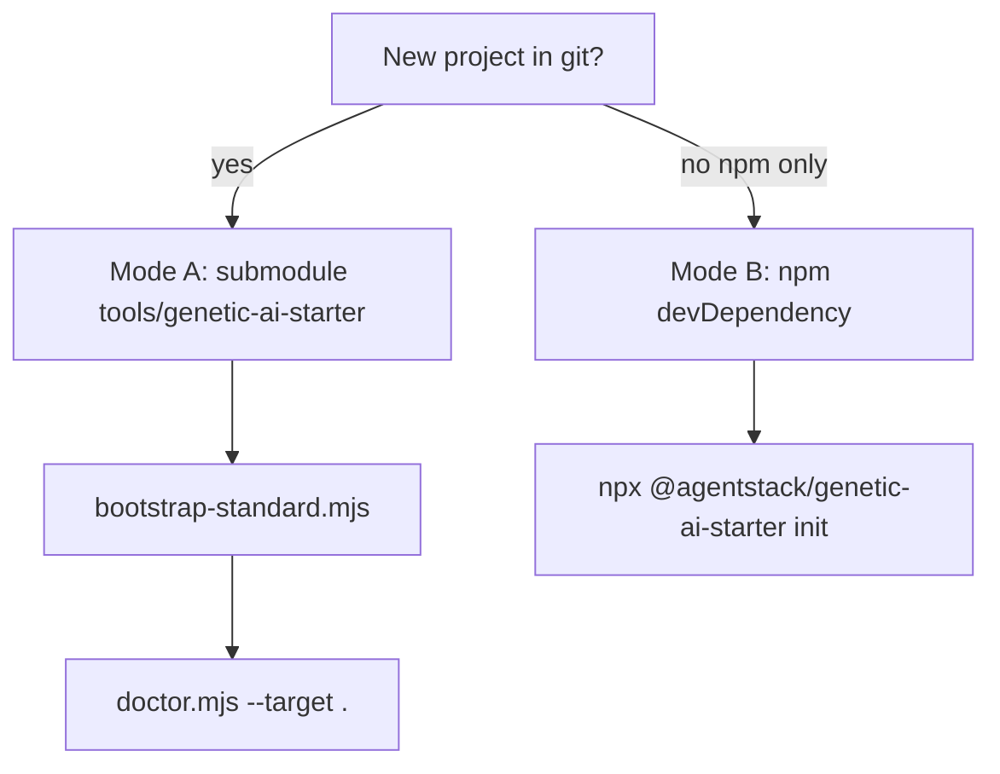

# Integration modes — Genetic AI Starter Kit

**Genetic tag:** `repo.tooling.genetic_starter.integration.gen1`

How to attach the **tooling plane** (scripts, payload source) to your repository and install the **navigation plane** (`philosophy/`, `docs/ai/`, Cursor rules).

## Decision tree



## Mode A — Submodule + standard (recommended)

**When:** Teams using git; reproducible CI; default for `standard` profile.

```bash
# Zero-kit (from empty repo root):
curl -fsSL https://raw.githubusercontent.com/agentstacktech/genetic-ai-starter/main/scripts/remote-bootstrap.mjs -o /tmp/gai-bootstrap.mjs
node /tmp/gai-bootstrap.mjs --target . --project-name "My App" --domain app --yes

# Or manual submodule + bootstrap:
git submodule add https://github.com/agentstacktech/genetic-ai-starter.git tools/genetic-ai-starter
git submodule update --init tools/genetic-ai-starter
node tools/genetic-ai-starter/scripts/bootstrap-standard.mjs --target . --project-name "My App" --domain app
node tools/genetic-ai-starter/scripts/doctor.mjs --target .
```

**Pin:** `kit.lock.json` stores `kitSource.ref` (commit SHA). Tag on mirror: `genetic-ai-starter-v0.4.11`.

## Mode B — npm

```bash
npm install -D @agentstack/genetic-ai-starter@0.4.11
npx genetic-ai-init init --yes --target . --profile standard --project-name "My App" --domain app
```

## Mode C — git subtree

For teams that refuse `git submodule update`. Vendor kit into a branch; still run `install.mjs` after merge. See git subtree documentation; pin the same tag as Mode A.

## Mode D — Monorepo sibling

```bash
export AGENTSTACK_MONOREPO=1
node ../AgentStack/genetic-ai-starter/scripts/bootstrap-standard.mjs --target . --kit-root ../AgentStack/genetic-ai-starter
```

## Mode E — AgentStack platform submodule

```bash
git submodule add https://github.com/agentstacktech/AgentStack.git platform/AgentStack
node platform/AgentStack/genetic-ai-starter/scripts/bootstrap-standard.mjs \
  --target . --profile full --kit-root platform/AgentStack/genetic-ai-starter --with-agentstack
```

## gitignore-kit full + submodule

| Path | Committed? |
|------|------------|
| `tools/genetic-ai-starter/` (submodule) | **Yes** — CI and teammates need scripts |
| `philosophy/`, `docs/ai/`, `.cursor/rules` | **No** (with `--gitignore-kit full`) — local-only navigation |

## CI

```yaml
- uses: actions/checkout@v4
  with:
    submodules: recursive
- run: node tools/genetic-ai-starter/scripts/ci-kit.mjs --target .
```

Drift check (optional): `node tools/genetic-ai-starter/scripts/check-submodule-drift.mjs --target .`

## Troubleshooting

| Symptom | Fix |
|---------|-----|
| Empty `tools/genetic-ai-starter` | `git submodule update --init --recursive` |
| `Kit root not found` | Run `bootstrap-standard` or set `GENETIC_AI_KIT_ROOT` |
| SHA drift | `node tools/genetic-ai-starter/scripts/upgrade.mjs --target . --sync-submodule` |

## See also

- [INSTALL.md](INSTALL.md) · [QUICK_SETUP.md](QUICK_SETUP.md) · [PROFILE_COMPARISON.md](PROFILE_COMPARISON.md)
- ADR (monorepo): `docs/adr/GENETIC_STARTER_SUBMODULE_INTEGRATION.md`
