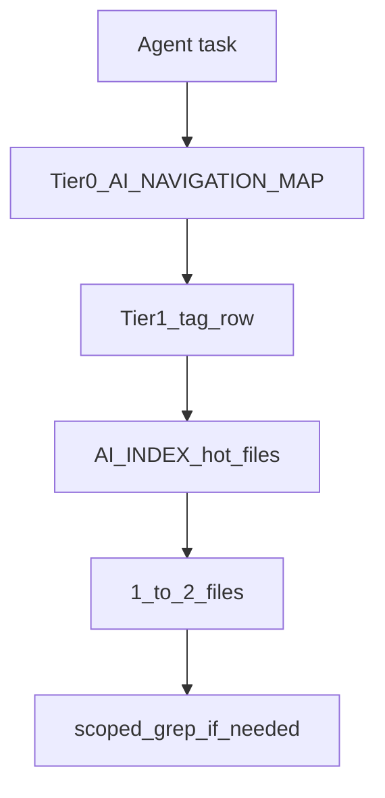

# Killer feature — manage large complex codebases

**RU:** [KILLER_FEATURE_LARGE_PROJECTS_ru.md](KILLER_FEATURE_LARGE_PROJECTS_ru.md) · **Rollout:** [LARGE_PROJECT_PLAYBOOK.md](LARGE_PROJECT_PLAYBOOK.md) · **Architecture:** [NAVIGATION_OS.md](NAVIGATION_OS.md)

## Genes

- `repo.navigation.map.gen1` · `repo.navigation.index.gen1` · `foundation.genetic_coding.gen1`

## Philosophy

PHILOSOPHY_INDEX → Decomposition → Reassembly · Time-Decomposition Contour

---

## Thesis

Methods that rely on **one AGENTS.md**, **generic rules only**, or **vector RAG without hierarchy** break down on monorepos with dozens of subsystems: duplicate paths, legacy folders, and cross-package boundaries overwhelm flat context.

**Genetic AI Starter Kit** ships a **semantic lattice**: Tier 0 (packages) → Tier 1 (subsystems) → `AI_INDEX.md` (hot files) → scoped edits — the same pattern AgentStack uses at scale, portable to any repo.



## What others cannot do (at scale)

| Approach | Limit on large repos |
|----------|----------------------|
| Whole-repo @codebase | Context ceiling, lost-in-middle |
| Vector RAG only | No explicit maintenance, index drift |
| README tree | No process genes, no Tier 1 |
| AGENTS.md alone | No genetic map, no compression |
| Generic `.cursorrules` | No path SoT, weak maintenance (T05) |

## Proof (harness + platform)

| Evidence | Detail |
|----------|--------|
| T05 maintenance | kit_standard **10** vs bare **4** vs agents_md **6** (scorer 1.1.1) |
| T08 + indexes | **10** with `AI_INDEX.md` vs **7** standard |
| T07 legacy trap | Map warns decoy; bare scores **1** |
| Smoke S04 | Dual-shell requires **PAGES_MAP** + `App.tsx` — not inferable from generic AGENTS |
| AgentStack monorepo | Tier 0 rows → `agentstack-core/mcp/AI_INDEX.md`, etc. |

## AgentStack consumer

`install --profile full --with-agentstack` adds MCP/8DNA routing; navigation genes still drive **where** to edit platform code.

## CTA

```bash
node genetic-ai-starter/scripts/install.mjs --target . --profile standard --project-name "My App" --domain app
```

Then [LARGE_PROJECT_PLAYBOOK.md](LARGE_PROJECT_PLAYBOOK.md) phases 0–5.
