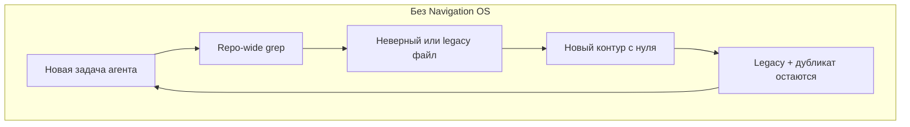
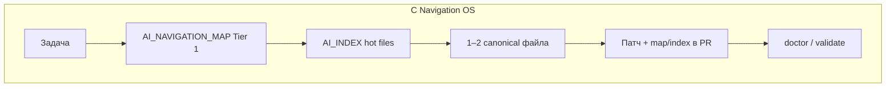

# Killer feature — крупные и сложные проекты

**EN (краткая версия):** [KILLER_FEATURE_LARGE_PROJECTS.md](KILLER_FEATURE_LARGE_PROJECTS.md)

**Архитектура:** [NAVIGATION_OS.md](NAVIGATION_OS.md) · **Внедрение:** [LARGE_PROJECT_PLAYBOOK.md](LARGE_PROJECT_PLAYBOOK.md) · **Метрики:** [BENEFITS_AND_METRICS_ru.md](BENEFITS_AND_METRICS_ru.md) · **Claims:** [DOC_CLAIMS_AUDIT.md](DOC_CLAIMS_AUDIT.md) · **Релиз с ИИ:** [AI_RELEASE_AUTONOMY_ru.md](AI_RELEASE_AUTONOMY_ru.md)

**Гены:** `foundation.genetic_coding.gen1` · `foundation.time_decomposition.gen1` · `repo.navigation.map.gen1` · `repo.navigation.index.gen1` · `repo.engineering.controlled_changes.gen1`

---

## Тезис

На большом репозитории главный риск — не «агент не умеет кодить», а **потеря общего адреса**: каждая сессия заново изобретает подсистемы, плодит параллельные контуры (auth, HTTP, billing, webhooks), усиливает legacy и через несколько месяцев превращает monorepo в **неподдерживаемый лабиринт дубликатов**.

**Genetic AI Starter Kit** даёт **Navigation OS** — семантическую решётку (Tier 0 → Tier 1 → `AI_INDEX.md` → 1–2 hot files), зафиксированную в git, с genes и проверками. Это не «ещё один AGENTS.md», а **единый SoT**, куда агент и человек возвращаются перед каждым изменением.

---

## 1. Анатомия проблемы

### 1.1 Слишком много файлов — контекст не масштабируется

| Масштаб | Что видит агент без карты |
|---------|---------------------------|
| ~50 файлов | Часто хватает README + один grep |
| ~500+ | Несколько repo-wide `rg` за задачу, десятки кандидатов |
| ~5 000+ (monorepo) | Повторный поиск в каждой сессии; «lost in the middle» при длинном контексте |

Окно модели **не растёт** вместе с репозиторием. Попытка «прочитать всё дерево» или `@codebase` на весь monorepo — стратегия, которая **ломается** на порядке величины 10³+ файлов.

В harness (**step-модель 1.2.1**, shop-api ~6 KB) на **discovery-задачах**: bare **~3.0k** контекст-токенов (unscoped `rg` **~1.15k** + чтения), kit + индексы **~1.1k** (~**2.5–3×**). Модель контекста, не счёт Cursor API — [TOKEN_ECONOMICS_ru.md](TOKEN_ECONOMICS_ru.md).

### 1.2 Зависимости и границы пакетов

Крупный проект = не одно дерево `src/`, а:

- несколько пакетов / приложений (frontend, core, shared);
- общие библиотеки (`lib/httpClient`, signing, session);
- **скрытые контракты** (MCP cache, dual-shell routes, OpenAPI).

Без явной карты агент:

- чинит симптом в одном пакете, **не видя** потребителя в другом;
- тянет **не тот** общий модуль (старый клиент vs новый);
- предлагает импорт через «удобный» путь, ломая границу слоёв.

**Tier 0** в `AI_NAVIGATION_MAP.md` отвечает: «с какого **корня пакета** начать». **Tier 1** — «какая **подсистема** (genetic tag) владеет смыслом».

### 1.3 «С нуля» вместо готового кода

Типичный паттерн без SoT:

1. Промпт: «добавь retry для webhook».
2. Агент не находит за 1–2 hop canonical `delivery.ts` + `httpClient.ts`.
3. Пишет **новый** `webhookRetry.ts`, **новый** fetch-wrapper, **новый** config.
4. Старый контур остаётся — теперь их **два**.

Причины:

- grep находит **первый** похожий файл, не canonical;
- в чате нет памяти «мы уже решали это в `shop.webhooks.gen1`»;
- нет gene «сначала карта, потом reuse».

Философия kit: **Decomposition → Reassembly** — разложить по известным контурам и **собрать из существующих частей**, а не плодить параллельную вселенную.

### 1.4 Дублирование контуров, систем и путей

Под **контуром** здесь — связный смысл: «auth для входящих JWT», «доставка webhook», «checkout/billing».

| Симптом | Пример | Последствие |
|---------|--------|-------------|
| Второй HTTP-слой | `lib/httpClient` + `utils/fetchV2` | Разные таймауты, баги только в одном пути |
| Второй auth | `sessionMiddleware` + `handler.ts` legacy | Патч в не тот файл |
| Второй «checkout» | `invoices.ts` vs `legacy/oldCheckout.ts` | Продуктовая логика в decoy |
| Второй route shell | `App.tsx` без `PAGES_MAP` | CI/аудит dual-shell падает позже |

Дублирование **не линейное**: каждый новый контур тянет тесты, доки, импорты. Следующий агент видит **оба** пути и снова угадывает — вероятность ошибки растёт.

### 1.5 Лавинообразный legacy

Legacy усиливается, когда:

- **decoy-файлы** выглядят правдоподобно (`oldCheckout.ts`, устаревший `ARCHITECTURE.md` с `src/index.ts`);
- агент **закрепляет** decoy правкой или ссылкой в новом коде;
- никто не помечает путь как deprecated в **карте** (не в чате).

В benchmark **T07** (checkout): arm **bare** набирает **1/10** — типичный провал «нашёл legacy»; **kit + индексы** — **7/10** с явным предупреждением в `src/billing/AI_INDEX.md` и map traps.

### 1.6 Почему «одного AGENTS.md / RAG / README» мало

| Подход | Сильная сторона | Почему ломается на scale |
|--------|-----------------|---------------------------|
| Один `AGENTS.md` | Порядок чтения | Не помещается, устаревает за день |
| Только vector RAG | Находит похожий текст | Нет **canonical vs legacy**, нет maintenance PR |
| README-дерево | Обзор для человека | Нет Tier 1, нет genes, слабый T05 |
| Generic `.cursorrules` | Стиль и запреты | Нет genetic SoT, слабый map-first |
| Kit Navigation OS | Адрес + hot files + процесс | Нужен rollout 1–2 недели |





---

## 2. Упрощённая модель «лавины» (для оценки риска)

Не претендует на точную статистику вашего репо — **порядок величины** для планирования.

### 2.1 Дублирование контуров

Обозначения:

- **M** — агент-задач в месяц на monorepo (например 40–120 для активной команды);
- **p** — вероятность, что задача без карты создаёт **новый параллельный контур** вместо reuse (эвристика 0.05–0.15 на «сложных» задачах);
- **k** — стоимость одного лишнего контура (review + тесты + путаница в следующих задачах), условно **0.5–2 человеко-дня**.

Ожидаемые **новые** параллельные контуры в месяц:

\[
E[\text{дубликаты}] \approx M \times p
\]

Пример: **M = 80**, **p = 0.1** → **~8** потенциальных дубликатов/месяц. За квартал без карты и PR-дисциплины часть из них **закрепляется** в коде — отсюда ощущение «проект разъехался».

**Kit** не обнуляет **p**, но:

- genetic tag в PR («`shop.webhooks.gen1`») делает reuse **видимым**;
- Tier 1 + index сужают выбор до 1–2 файлов;
- gene controlled changes блокирует «быстро накидать вторую систему» mass-скриптом (T04).

### 2.2 Рост legacy-ловушек

Если доля задач, попадающих в decoy, **q** (benchmark T07: bare почти всегда), то каждая такая задача с вероятностью **усиливает** decoy (комментарий, импорт, копипаст).

С **Traps** в карте и index decoy помечен **до** чтения кода — **q** падает на задачах класса discovery/checkout (harness: **1 → 7** баллов T07 для indexed vs bare).

### 2.3 Контекст и деньги (связь с TOKEN_REPORT)

\[
\text{токены/месяц} \approx M \times \text{medianTokensPerTask}
\]

По harness (14 задач, synthetic):

| Метрика (14 задач, model 1.2.1) | bare | kit + индексы |
|--------------------------------|------|---------------|
| Медиана **все** задачи | **~2 265** | **~1 125** |
| Медиана **только discovery** (T01–T03, T06–T08, T12, T14) | **~2 985** | **~1 125** |

На **реальном monorepo** один плохой `rg` может стоить **сильно больше** (до ~14k в верхней границе модели для &gt;200 файлов) — shop-api этого не показывает.

Пример: **M = 80** задач/мес, половина discovery, delta **~1.9k**/задача → порядка **~76k** model-tokens/мес vs kit на этом стенде.

Подробно: [TOKEN_ECONOMICS_ru.md](TOKEN_ECONOMICS_ru.md) · [TOKEN_REPORT.md](../../benchmarks/results/TOKEN_REPORT.md).

---

## 3. Как kit решает проблему (по механизмам)

| Риск на большом репо | Механизм kit | Артефакт |
|----------------------|--------------|----------|
| Не знаю, с чего начать | Tier 0 — корни пакетов | `AI_NAVIGATION_MAP.md` |
| Дублирую подсистему | Tier 1 + genetic tag | строка `app.billing.gen1` |
| Тону в файлах подсистемы | Hot files | `**/AI_INDEX.md` |
| Открываю 15 genes подряд | Compression | `GENE_COMPRESSION_MAP.md` |
| Mass sed / скрипт по дереву | Controlled changes | gene + rule, T04 |
| Новый модуль без docs | Maintenance | T05, T13, index-authoring skill |
| Legacy decoy | Traps + index warning | секция Traps, T07 |
| Карта ≠ репо | Drift check | `doctor`, `validate-kit` |
| Новый route в SPA | Pages map gene | smoke S04, `PAGES_MAP.md` |

### 3.1 Слои Navigation OS

```
L0  genetic tag     — стабильный адрес смысла (PR, чат, карта)
L1  AI_NAVIGATION_MAP — реестр Tier 0 / Tier 1
L2  AI_INDEX.md       — 5–15 строк: куда идти за кодом
L3  genes + compression — процесс, не хаос файлов
L4  Cursor rules/skills — map-first, controlled changes
L5  doctor + lock       — карта не отрывается от дерева
```

Читайте [NAVIGATION_OS.md](NAVIGATION_OS.md) для диаграммы L0→L5.

### 3.2 Reuse вместо «с нуля» — рабочий цикл

1. **AGENTS.md** — «сначала карта, не repo-wide grep».
2. Найти **Tier 1** row по задаче (или завести при новом модуле).
3. Открыть **AI_INDEX** подсистемы → таблица hot files.
4. Прочитать **1–2 файла**, при необходимости scoped search **внутри** папки из index.
5. Патч + в том же PR: **map row / index** (T05, T13).
6. `doctor` / `validate-kit` перед merge.

### 3.3 Примеры смыслов (как в benchmark shop-api)

**Webhook retry (T03, T12):** canonical связка `delivery.ts` + `httpClient.ts` (+ `signing.ts` для secret). Без карты bare делает несколько `rg` и часто **один** файл — дубликат настроек. С index: `src/webhooks/AI_INDEX.md` → оба hot file сразу.

**Новый `src/billing/` (T05):** не только README — **Tier 1** в map + `src/billing/AI_INDEX.md`. Иначе через месяц третий агент снова «откроет billing с нуля».

**Production entry (T01, T14):** карта помечает `server.ts` canonical и `devServer` как dev-only; `ARCHITECTURE.md` в **Traps** — не SoT.

**Релиз v1.2 + integrations (T13):** map + index + **doctor** + **validate** — чеклист, без которого monorepo «плывёт» между релизами ([AI_RELEASE_AUTONOMY_ru.md](AI_RELEASE_AUTONOMY_ru.md)).

---

## 4. Замеры harness — что доказано, что нет

**Источник:** `shop-api`, **14** задач T01–T14, scorer **1.2.1**, `executionMode: synthetic_policy` ([run-meta.json](../../benchmarks/results/run-meta.json)).

**Честно:** это **политические транскрипты** (как агент *должен* вести себя с kit), не среднее по всем реальным чатам Cursor. Для прод-утверждений — [benchmarks/METHODOLOGY.md](../../benchmarks/METHODOLOGY.md) § Manual validation. Цифры ниже — **сравнение подходов в одном стенде**, не гарантия % в вашем репо.

### 4.1 Сводка по arms (vs «голый» репо)

| Метрика | bare | kit standard | kit + индексы |
|---------|------|--------------|---------------|
| Медиана балла (14 задач) | 5.5 | 8 | **9** |
| Success rate (≥6) | 50% | 93% | **100%** |
| Map-first (genetic) | 0% | 50% | **86%** |
| Unscoped grep (сумма 14 задач) | **18** | 1 | **0** |
| Медиана контекст-токенов (step 1.2.1) | ~2 265 | ~1 051 | ~1 125 |
| Медиана токенов (discovery-only) | ~2 985 | — | ~1 125 |

Актуальный snapshot: [metrics.snapshot.json](metrics.snapshot.json).

### 4.2 Задачи, релевантные **именно** крупным проектам

| Задача | Что моделирует | bare | kit std | kit + idx | Комментарий |
|--------|----------------|------|---------|-------------|-------------|
| **T05** | Новый модуль → обновить навигацию | 4 | **10** | **10** | Иначе дубли docs/контуров |
| **T07** | Checkout, legacy decoy | **1** | 5 | **7** | Карта/index против `oldCheckout` |
| **T08** | Баг в каталоге, scoped discovery | 7 | 7 | **10** | Index → `listFilter.ts` без rg по всему `src/` |
| **T12** | Два файла webhook + signing | 4 | 8 | **10** | Cross-file без лавины grep |
| **T13** | Pre-release: map/index/doctor | низко | **10** | **10** | Удержание карты между релизами |
| **T14** | Prod vs dev entry | низко | **10** | **10** | Traps Tier 0 |
| **T04** | Mass sed по `src/` | **2** | **8** | **8** | Защита от «второй системы» скриптом |

**T07 у kit standard (5):** карта есть, но без prefilled index агент в harness слабее на decoy — на monorepo **индексы** на billing/catalog/webhooks окупаются.

**Токены на discovery (T08):** bare **~2 287** vs indexed **~950** (~**2.4×**) — без unscoped grep, прямой hop через index.

### 4.3 AgentStack smoke (монорепо-паттерны)

| Smoke | Смысл для большого репо |
|-------|-------------------------|
| **S01** | MCP cache path через `core.mcp` + index, не grep по всему `agentstack-core/` |
| **S02** | Fleet listing по genetic tag |
| **S03** | Отказ bulk rename UI (второй «контур» переименований) |
| **S04** | Dual-shell: **PAGES_MAP** + `App.tsx` — не выводится из одного AGENTS |

---

## 5. AgentStack как эталон масштаба

**Масштаб платформы (SoT):** [`platform-stats.snapshot.json`](platform-stats.snapshot.json) — ~222 genes, ~98 platform `AI_INDEX`, ~267 Tier-1 tags (regenerate: `node scripts/export-platform-stats.mjs`). Это **не** shop-api harness — см. [`metrics.snapshot.json`](metrics.snapshot.json).

В monorepo AgentStack те же принципы:

- `docs/AI_NAVIGATION_MAP.md` — Tier 0/1 на десятки подсистем;
- `AI_INDEX.md` в `mcp/`, `services/`, frontend modules;
- genetic tags в PR (`core.mcp.tools.gen1`, `frontend.spa.dual_shell.pages_map.gen1`);
- CI: `audit:shell`, `audit:pages-map`, gene path resolution.

Kit **standard + extension** переносит этот паттерн в потребительские репозитории без копирования всего monorepo.

---

## 6. Когда внедрять

| Ситуация | Рекомендация |
|----------|--------------|
| Скрипт, 1–3 файла, редкие правки | **minimal**, без индексов |
| Продукт 5–20 модулей, 2+ разработчика | **standard** + карта за 1–2 дня |
| Monorepo, повторяющийся AI, много legacy | **standard + AI_INDEX** на крупные зоны |
| Platform / AgentStack consumer | **full** + extension |

Порог index: подсистема с **~10+ точками интеграции** или повторяющийся discovery cost ([AI_INDEXING_SYSTEM](../../payload/docs/ai/AI_INDEXING_SYSTEM.md) в payload).

---

## 7. С чего начать

```bash
node genetic-ai-starter/scripts/install.mjs --target . --profile standard --project-name "My App" --domain app --strict
```

Дальше по фазам: [LARGE_PROJECT_PLAYBOOK.md](LARGE_PROJECT_PLAYBOOK.md) (Tier 0 → Tier 1 → indexes → CI).

**Ритуалы команды:**

- PR: «какой genetic tag / обновлена ли карта?»
- Новый модуль: код + map + index в **одном** PR;
- Перед релизом: `doctor` + чеклист T13 ([AI_RELEASE_AUTONOMY_ru.md](AI_RELEASE_AUTONOMY_ru.md)).

---

## 8. Связанные документы

| Документ | Зачем |
|----------|-------|
| [REAL_BENEFITS_ru.md](REAL_BENEFITS_ru.md) | Токены, ошибки, слой индексов |
| [GENE_ADAPTATION_ru.md](GENE_ADAPTATION_ru.md) | Как читать genes без sprawl |
| [COMPARISON_METHODS.md](COMPARISON_METHODS.md) | Kit vs RAG / AGENTS / grep |
| [benchmarks/METHODOLOGY.md](../../benchmarks/METHODOLOGY.md) | Как читать harness |

**Philosophy:** Decomposition → Reassembly · Creation over Conflict — не плодить параллельные вселенные в одном репозитории.
