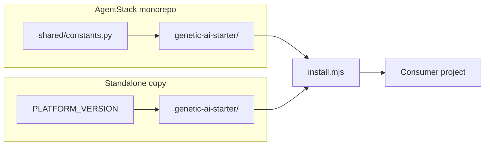

# Kit architecture — Genetic AI Starter Kit

## Layers

| Layer | Directory | Copied on install? |
|-------|-----------|---------------------|
| **Meta** | `meta/docs/` | No — kit documentation only |
| **Payload** | `payload/` | Yes — philosophy, `docs/ai/`, `.cursor/`, `AGENTS.md` |
| **Extensions** | `extensions/<id>/` | Optional (`--with-agentstack`) |
| **Profiles** | `profiles/*.json` | Selects payload globs |
| **Scripts** | `scripts/` | Stay in kit; invoked by path |
| **Benchmarks** | `benchmarks/` | No — kit QA only |

## Deployment modes

## Agent read order (target repo)

1. `AGENTS.md`
2. `.cursor/rules/genetic-navigation.mdc`
3. `docs/ai/AI_NAVIGATION_MAP.md`
4. `philosophy/genes/GENE_COMPRESSION_MAP.md` (multi-subsystem; not in minimal)
5. Nearest `**/AI_INDEX.md`

## Install artifacts (target)

| File | Purpose |
|------|---------|
| `.genetic-ai/kit.lock.json` | Profile, version, extensions |
| `.genetic-ai/paths.json` | `docsAi`, `philosophy` paths |
| `.cursorrules` | Merged `<!-- genetic-ai:begin/end -->` block |
| `docs/ai/OPERATIONS.md` | Repair / upgrade / doctor for consumers |

## Philosophy install logic

| Target state | Action |
|--------------|--------|
| No `philosophy/` | Copy all profile genes |
| Complete `philosophy/` | Skip (unless flags) |
| **Incomplete** `philosophy/` | **Auto `--force-philosophy`** |

Implementation: `scripts/lib/philosophy-state.mjs`.

## Version resolution

See `scripts/lib/platform-version.mjs` and [VERSION.md](../../VERSION.md).

## Profiles

| File | Intent |
|------|--------|
| `minimal.json` | Rules + stub map + minimal AGENTS |
| `standard.json` | Starter philosophy + full docs/ai |
| `full.json` | `payload/**` + AgentStack extension auto |
| `founder.json` | Same payload as `full`; founder workflow semantics |

**Comparison tables:** [PROFILE_COMPARISON.md](PROFILE_COMPARISON.md).

## Validation pipeline

1. `validate-kit.mjs` — payload integrity (maintainers)
2. `install.mjs` — copy + merge + lock
3. `validate-installed.mjs` — consumer links + required files
4. `doctor.mjs` — aggregate health

Install **exits non-zero** if step 3 fails.
