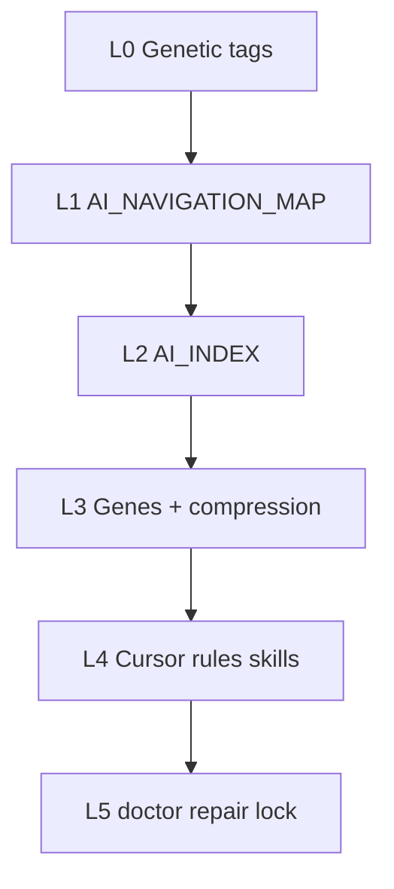

# Navigation OS — Genetic AI Starter Kit architecture

**Genetic tag:** `repo.tooling.genetic_starter.gen1` · **Install planes:** [KIT_ARCHITECTURE.md](KIT_ARCHITECTURE.md)

## Philosophy

PHILOSOPHY_INDEX → Decomposition → Reassembly · Elegant Minimalism · Creation over Conflict

---

## What Navigation OS is

Kit is a **portable navigation operating system** for human + agent work on code: vocabulary (tags) → registry (map) → subsystem views (indexes) → process memory (genes) → enforcement (rules/skills) → operations (doctor/lock) → evidence (benchmarks).

| Layer | Consumer artifacts | Gene |
|-------|-------------------|------|
| L0 | Tags in map, PRs, commits | `foundation.genetic_coding.gen1` |
| L1 | `docs/ai/AI_NAVIGATION_MAP.md` | `repo.navigation.map.gen1` |
| L2 | `**/AI_INDEX.md` | `repo.navigation.index.gen1` |
| L3 | `philosophy/genes/`, compression map | `foundation.ai_gene_interface.gen1` |
| L4 | `.cursor/rules`, `.cursor/skills`, `.cursorrules` block | `repo.engineering.controlled_changes.gen1` |
| L5 | `.genetic-ai/kit.lock.json`, `OPERATIONS.md` | `repo.tooling.genetic_starter.gen1` |

## Read order (runtime)

1. `AGENTS.md`
2. `.cursor/rules/genetic-navigation.mdc`
3. `docs/ai/AI_NAVIGATION_MAP.md`
4. `philosophy/genes/GENE_COMPRESSION_MAP.md` (multi-subsystem)
5. Nearest `AI_INDEX.md` → 1–2 hot files → scoped search

## Kit package planes

| Plane | Path | Installed? |
|-------|------|------------|
| Meta | `meta/docs/` | No — kit docs only |
| Payload | `payload/` | Yes |
| Extensions | `extensions/agentstack/` | Optional |
| Profiles | `profiles/*.json` | Selects payload |
| Scripts | `scripts/` | Invoked from kit path |
| Benchmarks | `benchmarks/` | QA only |

## Killer capability

**Large monorepos:** Tier 0 package roots + Tier 1 subsystems + indexes scale where single `AGENTS.md` or vector RAG alone drift. See [KILLER_FEATURE_LARGE_PROJECTS.md](KILLER_FEATURE_LARGE_PROJECTS.md).

## Cross-links

- [TOKEN_ECONOMICS.md](TOKEN_ECONOMICS.md)
- [METRICS_GLOSSARY.md](METRICS_GLOSSARY.md)
- [DOC_HUB.md](DOC_HUB.md)
