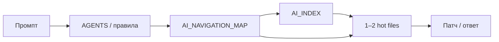

# Экономика токенов — map-first навигация

**EN:** [TOKEN_ECONOMICS.md](TOKEN_ECONOMICS.md)

**Отчёт по задачам:** [benchmarks/results/TOKEN_REPORT.md](../../benchmarks/results/TOKEN_REPORT.md) (после `run-matrix`).

**Гены:** `foundation.ai_gene_interface.gen1` · `repo.navigation.map.gen1` · `repo.navigation.index.gen1`

---

## Модель контекст-токенов (step 1.2.1)

Оценка **объёма контекста одной агент-сессии** на транскрипте harness. Это не биллинг Cursor API.

**Код:** `benchmarks/scripts/lib/token-model.mjs`

| Компонент | Правило |
|-----------|---------|
| Чтение файла | `ceil(bytes/4) + 280` (размер из `fixture-shop-api`, если файл есть) |
| Repo-wide `rg` | доля текста fixture (**55%** при ≤40 файлах), cap **2 500** на малый стенд |
| Scoped `rg` | **15%** текста, cap **1 200** |
| Промпт задачи | **420** (база) |
| Строка ответа агента | **180** |

**Стенд shop-api:** ~20 файлов, ~6,3 KB исходников (~1 577 токенов на весь репозиторий). Один unscoped `rg` в модели ≈ **1 148** контекст-токенов.

**Крупный monorepo** (в модели, вне shop-api): выше `fraction` и cap до **14 000** на один нецелевой `rg` — см. таблицу в `token-model.mjs`.

### Медианы harness (14 задач, synthetic)

| Arm | Все задачи | Только discovery* |
|-----|------------|-------------------|
| bare | **~2 265** | **~2 985** |
| kit + индексы | **~1 125** | **~1 125** |

\*T01–T03, T06–T08, T12, T14.

Сравнивайте **kit vs bare** на discovery; медианы **карта** и **+индексы** близки (~1 05k vs ~1 13k).

---

## Как токены тратятся на задачу



**Путь без карты (discovery):** промпт → `rg` по `src/` (~1,1k на shop-api за строку) → лишние чтения → иногда второй `rg`.

**Путь kit:** промпт → карта (~900) → index (~350) → hot file (~200–400) → патч.

**Пример T02 (оценка модели):**

| Шаг | bare | kit + индексы |
|-----|------|---------------|
| Поиск | `rg` ~1 148 | index → hot file |
| Чтения | jwt + middleware ~334 | sessionMiddleware ~423 |
| Промпт + ответ | ~780 | ~877 |
| **Итого** | **~2 262** | **~1 300** |

---

## Задачи shop-api (направление экономии)

| Задача | bare | kit + индексы | Источник дельты |
|--------|------|---------------|-----------------|
| T02 JWT | ~2 262 | ~1 300 | без unscoped `rg` |
| T08 catalog | ~2 287 | ~950 | index → `listFilter.ts` |
| T12 webhooks | ~3 734 | ~950 | два файла без двойного `rg` |
| T04 sed | ~780 | ~600 | отказ от grep (качество) |

Полная таблица: **TOKEN_REPORT.md**.

---

## Малый проект — ориентир

Допущения: **8 агент-задач/неделю**, медианы harness 1.2.1.

| | Токенов/неделя (модель) |
|---|-------------------------|
| bare (медиана все задачи) | ~18 100 |
| kit + индексы | ~9 000 |
| **Разница** | **~9 100** |

Умножьте на цену input у провайдера. Кэш и многоходовый чат в модель не входят.

---

## Сравнение методов

| Метод | Токены | Структура |
|-------|--------|-----------|
| grep по дереву | Высокие, нестабильные | Нет |
| Только RAG | Средние | Дрейф индекса |
| Только AGENTS.md | Средние | Нет Tier 1 |
| **Genetic kit (карта)** | Ниже на discovery | Tier 0/1 |
| **+ AI_INDEX** | Короче hop к hot files | Подсистема |
| **Гибрид kit + RAG** | Средне-низкие | Код по карте, prose по RAG |

---

## Ограничения модели

- Не заменяет замеры на вашем monorepo — см. [benchmarks/METHODOLOGY.md](../../benchmarks/METHODOLOGY.md) § Manual validation.
- Не учитывает `@codebase`, кэш, повторные уточнения пользователя.
- Harness: `executionMode: synthetic_policy` — см. [METRICS_GLOSSARY.md](METRICS_GLOSSARY.md).

---

## Инструменты

```bash
node genetic-ai-starter/benchmarks/scripts/estimate-tokens.mjs --transcript path.txt
node genetic-ai-starter/benchmarks/scripts/run-matrix.mjs
node genetic-ai-starter/scripts/export-metrics-snapshot.mjs
```

---

## Когда kit не окупается

Один файл, редкие правки, &lt;5 модулей — профиль **minimal** без индексов.
