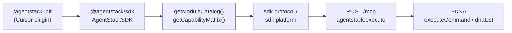

# Gene — `repo.platform.sdk.onboarding.gen1`

**Genetic tag:** `repo.platform.sdk.onboarding.gen1`  
**Category:** repo / platform / sdk  
**Status:** ACTIVE

---

## Intent

Canonical **develop-on-AgentStack** onboarding path for integrators and AI agents: from zero in a consumer repo to authenticated, project-scoped calls on the correct channel (SDK protocol plane, not ad hoc `fetch`).

**North star:** discover before execute; gate optional modules; prefer typed SDK surfaces over raw HTTP.

---

## Onboarding pipeline (ordered)

| Step | Entry | Doc / code |
|------|-------|------------|
| 1 — Plugin init | `/agentstack-init` (Device Code → Bearer) | [provided_plugins/cursor-plugin/README.md](https://github.com/agentstacktech/AgentStack/tree/main/provided_plugins/cursor-plugin/README.md) · `repo.plugins.oauth_device_code.gen1` |
| 2 — SDK install | npm / submodule / monorepo `file:` | [agentstack-unified-sdk/docs/SDK_INTEGRATION_FLOWS.md](https://github.com/agentstacktech/AgentStack/tree/main/agentstack-unified-sdk/docs/SDK_INTEGRATION_FLOWS.md) |
| 3 — Bootstrap | `AgentStackSDK`, `resolveAgentStackApiBase()`, login, `updateProjectId` | [agentstack-unified-sdk/AGENTS.md](https://github.com/agentstacktech/AgentStack/tree/main/agentstack-unified-sdk/AGENTS.md) § 60-second bootstrap |
| 4 — Discover | `getModuleCatalog()`, `getCapabilityMatrix()` | [docs/SDK_AI_SURFACE.md](https://github.com/agentstacktech/AgentStack/tree/main/docs/SDK_AI_SURFACE.md) · recipe `01-discover-capabilities` |
| 5 — Execute (app) | `sdk.platform.*`, `sdk.protocol.*` | [docs/AGENT_PROTOCOL_QUICKSTART.md](https://github.com/agentstacktech/AgentStack/tree/main/docs/AGENT_PROTOCOL_QUICKSTART.md) · `repo.platform.sdk.agent_protocol.gen1` |
| 6 — Execute (agent) | `POST /mcp` + `agentstack.execute` | [docs/MCP_BUSINESS_FLOWS.md](https://github.com/agentstacktech/AgentStack/tree/main/docs/MCP_BUSINESS_FLOWS.md) · recipe `03-mcp-execute` |
| 7 — Data plane | `sdk.protocol.executeCommand`, DNA KV snapshots | [docs/8DNA_UNIFIED_REFERENCE.md](https://github.com/agentstacktech/AgentStack/tree/main/docs/8DNA_UNIFIED_REFERENCE.md) · recipe `02-8dna-crud` |

---

## Kit consumer shortcuts

| Artifact | Path after `--with-agentstack` |
|----------|--------------------------------|
| SDK bootstrap module | `src/lib/agentstack.ts` (from extension overlay) |
| Env template | `.env.example` — `AGENTSTACK_PROJECT_ID`, API key / login |
| MCP config | `.cursor/mcp.json.template` — copy or plugin-written `~/.cursor/mcp.json` |
| Runnable walkthrough | `extensions/agentstack/recipes/00-bootstrap` |

Install SDK in recipes folder per [SDK_ACQUISITION.md](../../../extensions/agentstack/recipes/SDK_ACQUISITION.md) (Flow A npm default).

---

## AI instructions

1. Read [AGENTS.md](https://github.com/agentstacktech/AgentStack/tree/main/agentstack-unified-sdk/AGENTS.md) before adding integration code — anti-patterns are explicit (no raw `/api` when SDK exists; no `sdk.admin` for tenants).
2. Call **`getCapabilityMatrix()`** before optional domains (`commerce`, `economy`, `logic`, `hosting`, …).
3. Prefer **`sdk.protocol`** for command bus + snapshot cache; use **`sdk.platform`** for stable auth/api/dna subset ([docs/SDK_AI_SURFACE.md](https://github.com/agentstacktech/AgentStack/tree/main/docs/SDK_AI_SURFACE.md)).
4. For automation batches, mirror MCP steps from **`GET /mcp/actions`** — never invent action names (`repo.plugins.capability_routing.gen1`).
5. Set **project scope** (`updateProjectId` / `X-Project-ID`) before project-scoped writes ([agentstack-unified-sdk/docs/PROJECT_CONTEXT.md](https://github.com/agentstacktech/AgentStack/tree/main/agentstack-unified-sdk/docs/PROJECT_CONTEXT.md)).

---

## Cross-links

- [agentstack-unified-sdk/AGENTS.md](https://github.com/agentstacktech/AgentStack/tree/main/agentstack-unified-sdk/AGENTS.md) — AI agent bootstrap + decision tree
- [agentstack-unified-sdk/docs/SDK_INTEGRATION_FLOWS.md](https://github.com/agentstacktech/AgentStack/tree/main/agentstack-unified-sdk/docs/SDK_INTEGRATION_FLOWS.md) — Flow A–H acquisition map
- [repo.platform.sdk.unified.gen1.md](https://github.com/agentstacktech/AgentStack/tree/main/philosophy/genes/repo.platform.sdk.unified.gen1.md) — SDK integration umbrella
- [repo.platform.sdk.recipes.gen1.md](repo.platform.sdk.recipes.gen1.md) — runnable recipes 00–11
- [repo.platform.capability_contract.gen1.md](repo.platform.capability_contract.gen1.md) — discoverability drift contract
- [repo.tooling.genetic_starter.agentstack_dx.gen1.md](repo.tooling.genetic_starter.agentstack_dx.gen1.md) — DX expansion umbrella
- [genetic-ai-starter/extensions/agentstack/AI_INDEX.md](../../../extensions/agentstack/AI_INDEX.md) — extension hot files
- [docs/plugins/CONTEXT_FOR_AI.md](https://github.com/agentstacktech/AgentStack/tree/main/docs/plugins/CONTEXT_FOR_AI.md) — MCP / domain routing
